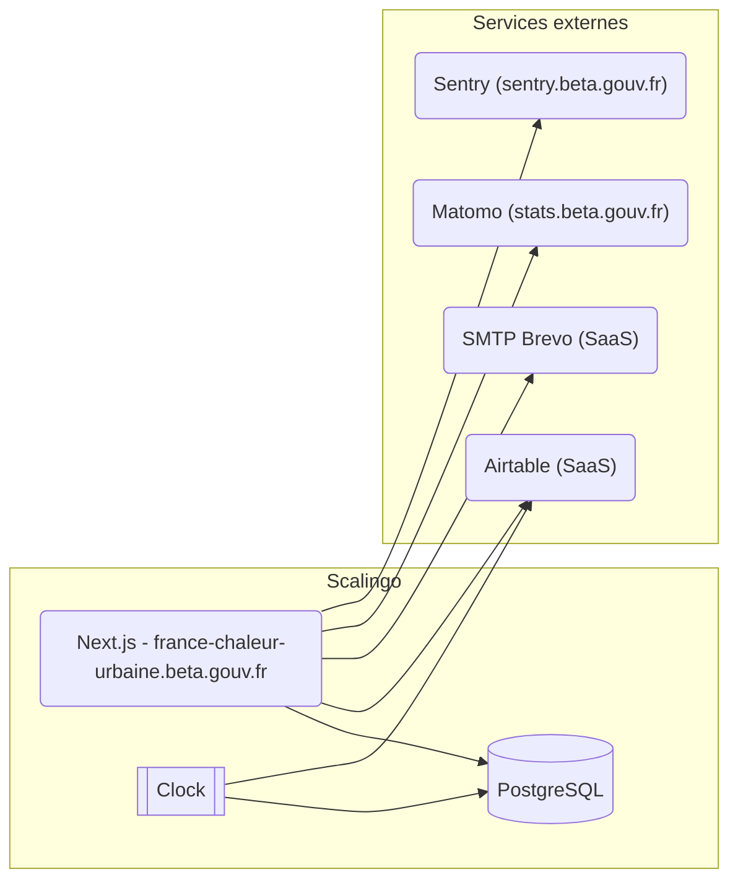

# Architecture Documentation

> Software architecture documentation for france-chaleur-urbaine

## 🎯 Introduction and Goals

### Business Context

<!-- Describe the business problem this software solves -->

<!-- Source: CLAUDE.md and README.md -->

**What**: France Chaleur Urbaine is a public service platform for connecting to district heating networks in France.

**Why**: Provide a centralized platform for French citizens and organizations to connect to district heating networks, supporting France's energy transition goals.

**For whom**: French citizens, heating network operators, and government agencies

### Quality Goals

<!-- Top 3-5 quality attributes in order of priority -->

1. **[Quality Goal 1]**: [e.g., Performance - Response time < 200ms]
2. **[Quality Goal 2]**: [e.g., Security - GDPR compliance]
3. **[Quality Goal 3]**: [e.g., Maintainability - Easy to onboard new developers]

## 📐 Constraints

### Technical Constraints

<!-- Source: CLAUDE.md and README.md -->

- **Framework/Language**: Next.js 15 with TypeScript, Pages Router
- **Deployment**: Scalingo hosting platform
- **Databases**: PostgreSQL + PostGIS for spatial data
- **External APIs**: Airtable, Brevo (SMTP), Matomo, Sentry

### Organizational Constraints

- **Team size**: [Number of developers]
- **Timeline**: [Project deadlines]
- **Budget**: [Infrastructure costs]

## 🌍 System Context

### External Interfaces

<!-- What external systems does this software interact with? -->

```
┌─────────────┐
│   Browser   │
└──────┬──────┘
       │
┌──────▼──────────┐      ┌──────────────┐
│  france-chaleur-urbaine │◄────►│  External API │
└──────┬──────────┘      └──────────────┘
       │
┌──────▼──────┐
│  Database   │
└─────────────┘
```

### Users and Roles

- **[Role 1]**: [Permissions, use cases]
- **[Role 2]**: [Permissions, use cases]

## 🏗️ Solution Strategy

### Architecture Pattern

[e.g., Monolithic, Microservices, Serverless, Modular monolith]

### Technology Decisions

| Decision | Rationale |
|----------|-----------|
| Core | [Why this framework?] |
| [Database] | [Why this database?] |
| [Hosting] | [Why this hosting?] |

### Key Design Decisions

<!-- Link to ADRs (Architecture Decision Records) if you use them -->

- **[Decision 1]**: [Brief explanation or link to ADR]
- **[Decision 2]**: [Brief explanation or link to ADR]

## 🧱 Building Block View

<!-- Source: CLAUDE.md -->

### High-Level Structure

```
src/
├── components/         # React components by feature
├── pages/              # Next.js pages & API routes
├── modules/            # Code separated in modules for separation of concerns
├── server/             # Server-side services
├── services/           # Client-side services
├── utils/              # Shared utilities
└── types/              # TypeScript definitions
```

### Module Organization

<!-- Source: CLAUDE.md -->

#### Module Structure Standard

**Purpose**: Each module contains feature-specific code with clear separation of concerns

**Structure**:
```
modules/
├── feature-name/     # All feature code
  ├── client/         # React components by feature
  ├── server/         # Server files (logic, apis, services)
  ├── constants       # If needed, constants
  ├── README.md       # Description of feature and possible dependencies
```

**Location**: `src/modules/[module-name]/`

## ⚡ Runtime View

### Key Scenarios

#### Scenario: [User Action]

```
User → Frontend → API → Service → Database
  │        │        │       │         │
  │────────┼────────┼───────┼─────────┤
  │        │        │       │         │
  │        │        │       │         │
  └────────┴────────┴───────┴─────────┘
```

**Steps**:
1. User initiates [action]
2. Frontend validates and sends request
3. API authenticates and authorizes
4. Service processes business logic
5. Database persists changes
6. Response flows back to user

## 🚀 Deployment View

<!-- Source: README.md -->

### Infrastructure

Le site de France Chaleur Urbaine est hébergé chez Scalingo, sous le compte du MTE (tristan-robert).
2 applications sont créées et branchées aux branches *main* et *dev* du dépôt GitHub.



Chaque application contient :
- un conteneur Next.js pour l'application web
- un conteneur clock qui est utilisé pour faire tourner des tâches récurrentes et de synchronisation
- une BDD PostgreSQL

<!-- Source: README.md and CLAUDE.md -->

### Environments

- **Development**: Local Docker setup with PostgreSQL and Mailpit
- **Dev Branch**: Development environment on Scalingo with review apps for pull requests
- **Production**: Main branch deployed to france-chaleur-urbaine.beta.gouv.fr on Scalingo

## 🔧 Cross-Cutting Concepts

### Authentication & Authorization

[How users are authenticated and authorized]

### Error Handling

[How errors are handled, logged, and reported to users]

### Logging & Monitoring

[What is logged, where, and how to access logs]

### Performance

[Caching strategy, optimization techniques]

### Security

[Security measures, see also: SECURITY.md]

## 🎨 Design Decisions

### Architectural Decision Records (ADRs)

[If using ADRs, link to them here or list key decisions]

**Example**:
- **ADR-001**: [Use PostgreSQL for main database]
- **ADR-002**: [Adopt module-based architecture]

## 📊 Quality Requirements

### Performance

- **Response time**: < 200ms for 95th percentile
- **Throughput**: [Requests per second]
- **Availability**: 99.9% uptime

### Security

- **Authentication**: JWT with refresh tokens
- **Data encryption**: At rest and in transit
- **Compliance**: GDPR, [other regulations]

### Maintainability

- **Test coverage**: > 80%
- **Code review**: Required for all changes
- **Documentation**: Keep up to date with code

## ⚠️ Risks and Technical Debt

### Current Risks

| Risk | Impact | Mitigation |
|------|--------|------------|
| [Risk 1] | High/Med/Low | [How to mitigate] |
| [Risk 2] | High/Med/Low | [How to mitigate] |

### Known Technical Debt

- **[Debt Item 1]**: [Description, priority]
- **[Debt Item 2]**: [Description, priority]

## 📚 Glossary

| Term | Definition |
|------|------------|
| [Term 1] | [Definition] |
| [Term 2] | [Definition] |

---

## 📝 Maintenance

**Last updated**: [Date]
**Maintained by**: [Team/Person]
**Review frequency**: [Quarterly, when architecture changes]

## 🔗 Related Documentation

- [README.md](../../README.md) - Project overview and setup
- [SECURITY.md](./SECURITY.md) - Security guidelines
- [TESTING.md](./TESTING.md) - Testing strategy
- Module-specific docs: Check `AGENTS.md` in each module folder