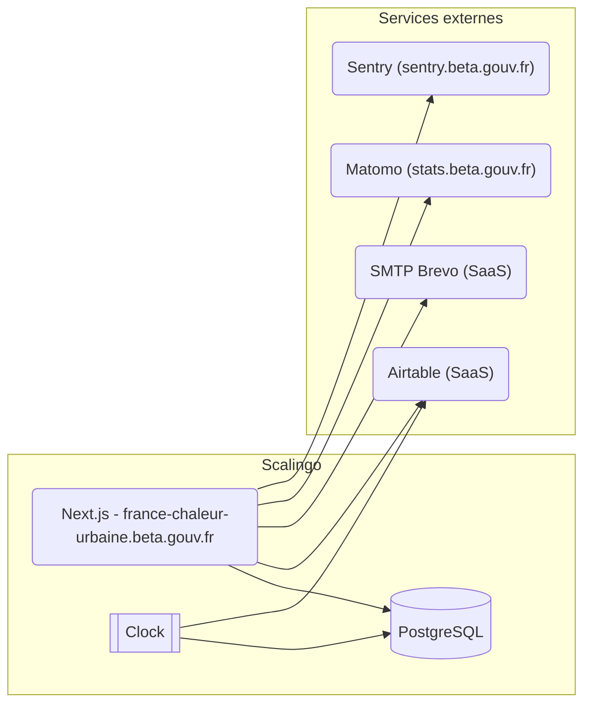

# Architecture Documentation

> Software architecture documentation for france-chaleur-urbaine

## 🎯 Introduction and Goals

### Business Context

<!-- Describe the business problem this software solves -->

**What**: {{PROJECT_DESC}}

**Why**: [Why does this software exist? What business value does it provide?]

**For whom**: [Target users, stakeholders]

### Quality Goals

<!-- Top 3-5 quality attributes in order of priority -->

1. **[Quality Goal 1]**: [e.g., Performance - Response time < 200ms]
2. **[Quality Goal 2]**: [e.g., Security - GDPR compliance]
3. **[Quality Goal 3]**: [e.g., Maintainability - Easy to onboard new developers]

## 📐 Constraints

### Technical Constraints

- **Framework/Language**: Core
- **Deployment**: [Cloud provider, hosting environment]
- **Databases**: [PostgreSQL, MongoDB, Redis, etc.]
- **External APIs**: [Third-party services]

### Organizational Constraints

- **Team size**: [Number of developers]
- **Timeline**: [Project deadlines]
- **Budget**: [Infrastructure costs]

## 🌍 System Context

### External Interfaces

<!-- What external systems does this software interact with? -->

```
┌─────────────┐
│   Browser   │
└──────┬──────┘
       │
┌──────▼──────────┐      ┌──────────────┐
│  france-chaleur-urbaine │◄────►│  External API │
└──────┬──────────┘      └──────────────┘
       │
┌──────▼──────┐
│  Database   │
└─────────────┘
```

### Users and Roles

- **[Role 1]**: [Permissions, use cases]
- **[Role 2]**: [Permissions, use cases]

## 🏗️ Solution Strategy

### Architecture Pattern

[e.g., Monolithic, Microservices, Serverless, Modular monolith]

### Technology Decisions

| Decision | Rationale |
|----------|-----------|
| Core | [Why this framework?] |
| [Database] | [Why this database?] |
| [Hosting] | [Why this hosting?] |

### Key Design Decisions

<!-- Link to ADRs (Architecture Decision Records) if you use them -->

- **[Decision 1]**: [Brief explanation or link to ADR]
- **[Decision 2]**: [Brief explanation or link to ADR]

## 🧱 Building Block View

<!-- Source: CLAUDE.md -->

### High-Level Structure

```
project/
├── src/
│   ├── components/         # React components by feature
│   ├── pages/              # Next.js pages & API routes
│   ├── modules/            # Code separated in modules for separation of concerns
│   ├── server/             # Server-side services
│   ├── services/           # Client-side services
│   ├── utils/              # Shared utilities
│   └── types/              # TypeScript definitions
├── tests/
├── migrations/             # Database migrations
└── scripts/                # CLI and automation scripts
```

### Module Organization

<!-- Source: CLAUDE.md -->

Each module should be structured like this:

```
modules/
├── feature-name/     # All feature code
  ├── client/         # React components by feature
  ├── server/         # Server files (logic, apis, services)
  ├── constants       # If needed, constants
  ├── README.md       # Description of feature and possible dependencies
```

**API Routes Pattern**: All data operations go through `/api/` endpoints

If not in a distinct module:

```typescript
// Client: src/services/
// API: src/pages/api/
// Server: src/server/services/
```

If in a distinct module:

```typescript
// Client: src/modules/module-name/client/
// API: src/modules/module-name/client/api.ts
// Server: src/modules/module-name/server/
```

## ⚡ Runtime View

### Key Scenarios

#### Scenario: [User Action]

```
User → Frontend → API → Service → Database
  │        │        │       │         │
  │────────┼────────┼───────┼─────────┤
  │        │        │       │         │
  │        │        │       │         │
  └────────┴────────┴───────┴─────────┘
```

**Steps**:
1. User initiates [action]
2. Frontend validates and sends request
3. API authenticates and authorizes
4. Service processes business logic
5. Database persists changes
6. Response flows back to user

## 🚀 Deployment View

<!-- Source: README.md, CLAUDE.md -->

### Infrastructure

Le site de France Chaleur Urbaine est hébergé chez Scalingo, sous le compte du MTE (tristan-robert).
2 applications sont créées et branchées aux branches *main* et *dev* du dépôt [GitHub](https://github.com/betagouv/france-chaleur-urbaine).

Chaque application contient :
- un conteneur Next.js pour l'application web
- un conteneur clock qui est utilisé pour faire tourner des tâches récurrentes et de synchronisation
- une BDD PostgreSQL



### Environments

- **Development**:
  - Branch: `dev`
  - URL: france-chaleur-urbaine.incubateur.net
  - Review apps Scalingo sont utilisées pour créer des environnements à partir des pull requests GitHub
  - Les emails sont branchés sur smtp.ethereal.email
  - Utilise la base Airtable de production

- **Production**:
  - Branch: `main`
  - URL: france-chaleur-urbaine.beta.gouv.fr
  - Production on Scalingo : no dev on it
  - Pull requests create review apps automatically
  - Clock container runs scheduled tasks (see `scripts/`)

- **Local**:
  - Docker est utilisé pour 2 conteneurs :
    - Postgres pour la BDD
    - Mailpit est utilisé comme serveur SMTP et interface de visualisation des emails
  - L'application se lance sans conteneur, pour éviter les problèmes de droits avec les volumes mappés

## 🔧 Cross-Cutting Concepts

<!-- Source: CLAUDE.md -->

### Authentication & Authorization

Authentication uses custom session management (see `src/modules/auth/server/service.ts`)

### Database Access

Always use Kysely for type safety:

```typescript
import { kdb } from '@/server/db/kysely'
const networks = await db.selectFrom('reseaux_de_chaleur').selectAll().execute()
```

### Map Integration

Use MapLibre components in `src/components/Map/`
- Custom layers defined in `src/services/Map/`
- Coordinate transformations via Turf.js utilities

### Form Handling

Tanstack React Form with Zod validation

```typescript
// See src/components/form/ for examples
```

### State Management

- Server state: @tanstack/react-query
- Client state: jotai atoms
- URL state: nuqs hooks and useQueryFlag.tsx if no need for a value

### HTML Markup

- Use semantic HTML markup when needed
- Reduce the number of imbricated tags to the bare minimum

### Error Handling

[How errors are handled, logged, and reported to users]

### Logging & Monitoring

<!-- Source: README.md -->

FCU intègre plusieurs outils d'analyse d'audience :
- Matomo (stats.beta.gouv.fr)
- HotJar, utilisé notamment pour des sondages
- Google Analytics
- LinkedIn (obsolète)
- Facebook (obsolète)
- Sentry (sentry.beta.gouv.fr) pour error tracking

### Performance

All geographic data uses PostGIS and Turf.js for calculations

### Security

French government design system (DSFR) must be used for UI

### External Tools and Services

<!-- Source: README.md -->

- Un compte gmail est partagé pour l'équipe (france.chaleur.urbaine@gmail.com)
- [Trello](https://trello.com) est utilisé pour les kanbans des features
- [Airtable](https://airtable.com/) est utilisé pour enregistrer tout un tas de données
- [GitBook](https://www.gitbook.com/) est connecté au dépôt GitHub pour intégrer les actualités
- [Alwaysdata](https://www.alwaysdata.com/) est utilisé pour gérer les zones DNS
- Le [VaultWarden Beta](https://vaultwarden.incubateur.net/) est utilisé pour centraliser les mots de passe
- Le [Mattermost Beta](http://mattermost.incubateur.net/) est utilisé pour échanger avec l'équipe
- [Jitsi Meet](https://meet.liiib.re/) est utilisé pour faire des points en visio
- [Figma](figma.com) est utilisé pour les maquettes
- [Pipedrive](https://www.pipedrive.com/) est utilisé par les bizdev pour gérer les relations
- [Brevo](https://brevo.com/) est utilisé pour les emails transactionnels et campagnes marketing

GitHub repositories:
- https://github.com/betagouv/france-chaleur-urbaine : pour tout le code de l'application
- https://github.com/betagouv/france-chaleur-urbaine-publicodes : pour les règles du comparateur de modes de chauffage

Les règles publicodes sont publiées sur le registre [NPM](https://www.npmjs.com/package/@betagouv/france-chaleur-urbaine-publicodes)

## 🎨 Design Decisions

### Architectural Decision Records (ADRs)

[If using ADRs, link to them here or list key decisions]

**Example**:
- **ADR-001**: [Use PostgreSQL for main database]
- **ADR-002**: [Adopt module-based architecture]

## 📊 Quality Requirements

### Performance

- **Response time**: < 200ms for 95th percentile
- **Throughput**: [Requests per second]
- **Availability**: 99.9% uptime

### Security

- **Authentication**: JWT with refresh tokens
- **Data encryption**: At rest and in transit
- **Compliance**: GDPR, [other regulations]

### Maintainability

- **Test coverage**: > 80%
- **Code review**: Required for all changes
- **Documentation**: Keep up to date with code

## ⚠️ Risks and Technical Debt

### Current Risks

| Risk | Impact | Mitigation |
|------|--------|------------|
| [Risk 1] | High/Med/Low | [How to mitigate] |
| [Risk 2] | High/Med/Low | [How to mitigate] |

### Known Technical Debt

- **[Debt Item 1]**: [Description, priority]
- **[Debt Item 2]**: [Description, priority]

## 📚 Glossary

| Term | Definition |
|------|------------|
| [Term 1] | [Definition] |
| [Term 2] | [Definition] |

---

## 📝 Maintenance

**Last updated**: [Date]
**Maintained by**: [Team/Person]
**Review frequency**: [Quarterly, when architecture changes]

## 🔗 Related Documentation

- [README.md](../../README.md) - Project overview and setup
- [SECURITY.md](./SECURITY.md) - Security guidelines
- [TESTING.md](./TESTING.md) - Testing strategy
- Module-specific docs: Check `AGENTS.md` in each module folder
