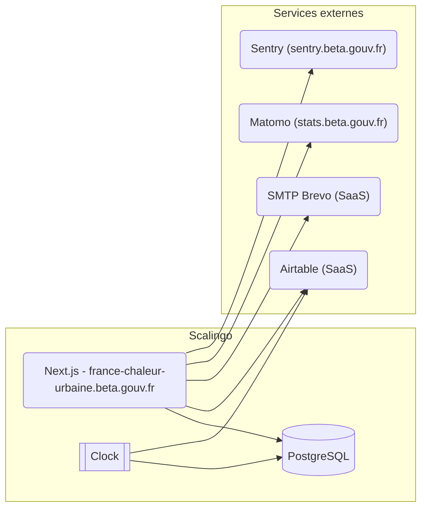

# Deployment and Tools

<!-- Source: /README.md -->

## Architecture de déploiement et outils

Le site de France Chaleur Urbaine est hébergé chez Scalingo, sous le compte du MTE (tristan-robert).
2 applications sont créées et branchées aux branches *main* et *dev* du dépôt [GitHub](https://github.com/betagouv/france-chaleur-urbaine).

Chaque application contient :
- un conteneur Next.js pour l'application web
- un conteneur clock qui est utilisé pour faire tourner des tâches récurrentes et de synchronisation
- une BDD PostgreSQL

Particularité de l'environnement de dev :
- Des review apps Scalingo sont utilisées pour créer des environnements à partir des pull requests GitHub.
- Les emails sont branchés sur smtp.ethereal.email
- Utilise la base Airtable de production

En local, Docker est utilisé pour 2 conteneurs :
- Postgres pour la BDD
- Mailpit est utilisé comme serveur SMTP et interface de visualisation des emails.
L'application se lance sans conteneur, pour éviter les problèmes de droits avec les volumes mappés et ne pas casser les chemins entre le code et l'IDE quand des stack traces apparaissent

FCU intègre plusieurs outils d'analyse d'audience :
- Matomo
- HotJar, utilisé notamment pour des sondages
- Google Analytics
- LinkedIn (obsolète)
- Facebook (obsolète)

GitHub contient 2 dépôts :
- https://github.com/betagouv/france-chaleur-urbaine : pour tout le code de l'application
- https://github.com/betagouv/france-chaleur-urbaine-publicodes : pour les règles du comparateur de modes de chauffage

Les règles publicodes sont publiées sur le registre [NPM](https://www.npmjs.com/package/@betagouv/france-chaleur-urbaine-publicodes) et utilisé comme dépendance par le projet principal. L'URL GitHub pages (https://betagouv.github.io/france-chaleur-urbaine-publicodes/) est également utilisée par le projet pour expliquer les règles en détail.

### Outils

- Un compte gmail est partagé pour l'équipe (france.chaleur.urbaine@gmail.com) et est souvent utilisé pour créer des comptes dans d'autres applications
- [Trello](https://trello.com) est utilisé pour les kanbans des features à développer sur le site et aussi less intégrations des tracés sur la carte
- [Airtable](https://airtable.com/) est utilisé pour enregistrer tout un tas de données, mais seulement pour l'application FCU
- [GitBook](https://www.gitbook.com/) est connecté au dépôt GitHub pour intégrer les actualités de FCU.
- [Alwaysdata](https://www.alwaysdata.com/) est utilisé pour gérer les zones DNS suivantes :
  - france-chaleur-urbaine.beta.gouv.fr (prod)
  - france-chaleur-urbaine.incubateur.net (dev)
- Le [VaultWarden Beta](https://vaultwarden.incubateur.net/) est utilisé pour centraliser les mots de passe des comptes (mais pas complètement encore !)
- Le [Mattermost Beta](http://mattermost.incubateur.net/) est utilisé pour échanger avec l'équipe avec ses différents canaux : Bizdev, Dev / UX, Team, Notifications (ce dernier est utilisé par Scalingo pour )
- [Jitsi Meet](https://meet.liiib.re/) est utilisé pour faire des points en visio
- [Figma](figma.com) est utilisé pour les maquettes
- [Pipedrive](https://www.pipedrive.com/) est utilisé par les bizdev pour gérer les relations avec les prospects et les usagers
- [Brevo](https://brevo.com/) est utilisé pour les emails transactionnels de FCU mais aussi les campagnes marketing.

