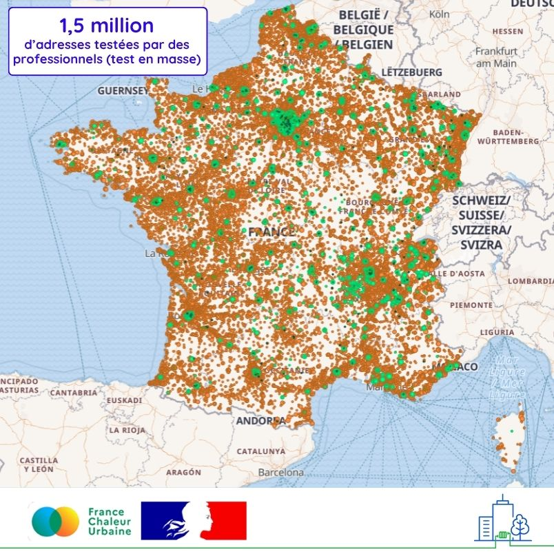

# 1.5 million d'adresses testées par des professionnels

1.5 million d'adresses ont été testées sur France Chaleur Urbaine grâce à l'outil de test en masse, qui permet d'identifier instantanément les bâtiments d'un parc situés à proximité de réseaux de chaleur en service ou en construction.

📌 L'ensemble des adresses testées sont représentées sur la carte ci-dessous : de nombreux réseaux sont à créer pour pouvoir raccorder toutes les adresses qui apparaissent en orange, aujourd'hui éloignées de tout réseau !

🏢 Le test en masse, très utilisé par les bailleurs sociaux, gestionnaires tertiaires et bureaux d'études, constitue aujourd'hui un outil indispensable lors de la mise en place de stratégies de décarbonation à l'échelle de parcs de bâtiments. Pour faciliter le passage à l'action, France Chaleur Urbaine accompagne également ses usagers dans le dépôt de demandes de mise en relation avec les gestionnaires des réseaux pour l'ensemble des bâtiments potentiellement raccordables.

<figure><figcaption></figcaption></figure>
