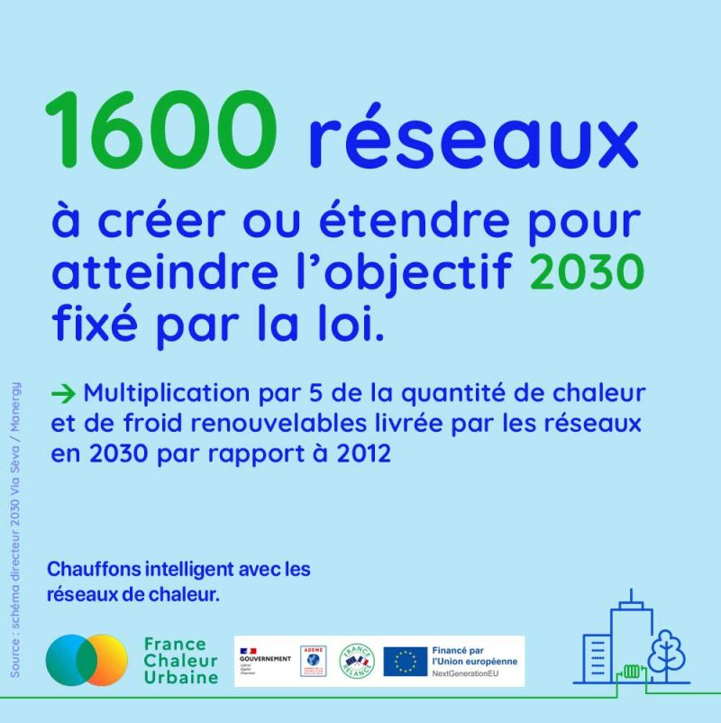

# 1600 réseaux à créer ou étendre

🏁 La loi impose un objectif ambitieux aux réseaux de chaleur, à la hauteur des enjeux de la  transition énergétique. En 2030, la quantité de chaleur et de froid renouvelables livrée par les réseaux devra être multipliée par 5, par rapport à 2012

Aujourd'hui, on compte 898 réseaux. Pour atteindre l'objectif fixé par la loi, 1300 réseaux devront être créés et 300 réseaux étendus partout en France, d'ici 2030 !

C'est le résultat du [schéma directeur national](https://www.reseauxdechaleur2030.fr/) réalisé par l'association Via Sèva et le bureau d'études Manergy, en partenariat avec la FEDENE et avec le soutien de l'ADEME.

\
🚀 Les 7 prochaines années devraient voir une accélération bénéfique et historique de la chaleur urbaine !

<figure><figcaption></figcaption></figure>
