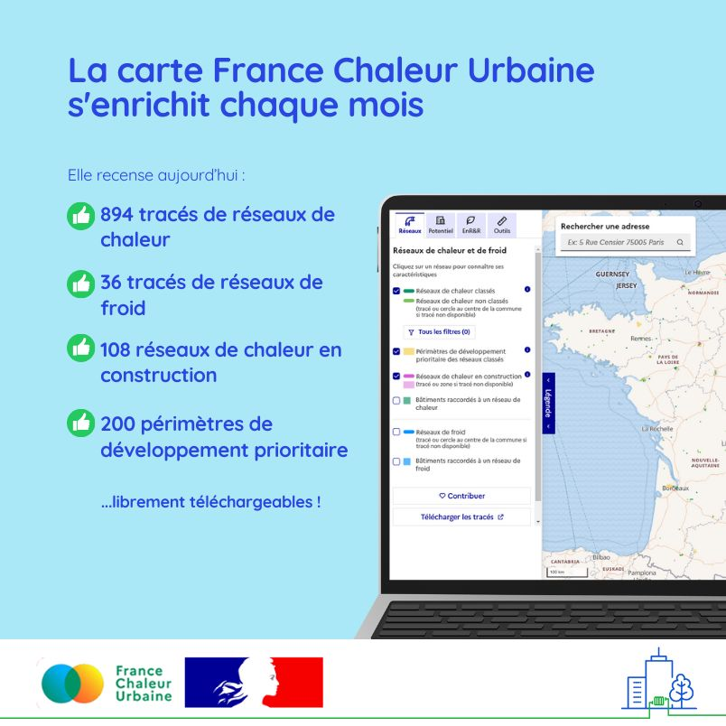

# 200 périmètres de développement prioritaire à découvrir sur notre carte

💫 La barre des 200 périmètres de développement prioritaire (PDP) de réseaux classés recensés sur notre [carte](/carte?additionalLayers=zonesDeDeveloppementPrioritaire) est franchie ce mois-ci !\
\
France Chaleur Urbaine est aujourd'hui la seule plateforme qui centralise cette information, cruciale pour accélérer le développement des réseaux de chaleur, puisque le raccordement de certains bâtiments est obligatoire dans ces zones.\
\
La carte s'enrichit également de 7 réseaux de chaleur en construction, notamment à Epinay-sous-Sénart, Bourg-la-Reine/Sceaux/Fontenay-aux-Roses, Villefranche-sur-Saône, Tours ou encore Port-de-Bouc.\
\
Enfin, le fichier open data du mois, disponible sur [data.gouv.fr](https://www.data.gouv.fr/fr/datasets/traces-des-reseaux-de-chaleur-et-de-froid/), a été mis à jour avec les taux d'énergies renouvelables et de récupération et contenus CO2 des réseaux de l'année 2023, tirés de l'[arrêté en date du 11 avril 2025](https://www.legifrance.gouv.fr/jorf/id/JORFTEXT000051520810).

<figure><figcaption></figcaption></figure>
