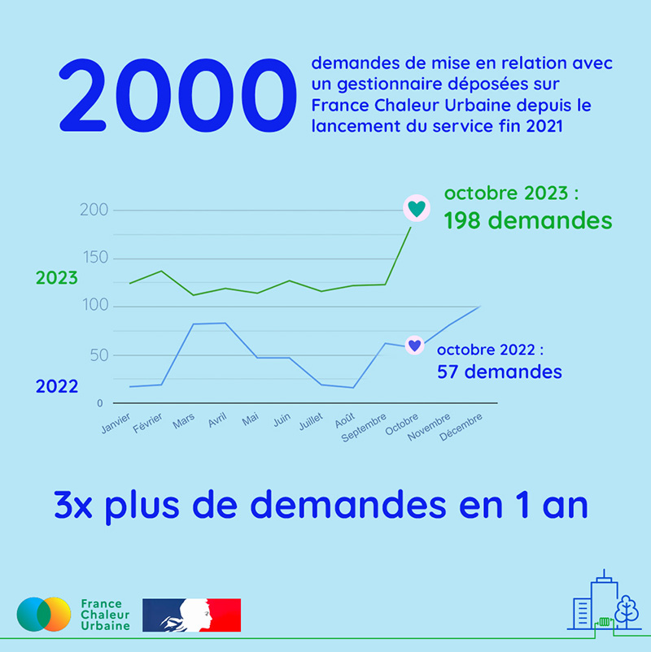

# 2000 demandes

🎉 Aujourd’hui nous avons atteint les 2000 demandes de mise en relation avec un gestionnaire de réseau de chaleur déposées sur France Chaleur Urbaine ! Rien qu'au mois d'octobre 2023, 198 demandes ont été déposées, soit 3,5 fois plus qu'en octobre 2022.\
\
📈 C'est l'occasion pour nous de vous partager notre nouvelle page statistiques (lien en commentaire), sur laquelle vous pourrez retrouver l'évolution des principaux indicateurs de réussite du service.\
\
👉 Vous y découvrirez que France Chaleur Urbaine, c'est aussi :\
\- 500 raccordements aujourd'hui à l'étude ;\
\- 72 630 adresses déjà testées sur le site, majoritairement par des copropriétaires ;\
\- 376 990 adresses testées par des professionnels grâce à notre fonctionnalité permettant le test en masse d'un grand nombre d'adresses : un outil précieux pour les bailleurs sociaux et gestionnaires de bâtiments tertiaires, qui peuvent ainsi identifier en un instant les bâtiments potentiellement raccordables de leur parc ;\
\- 417 téléchargements du jeu de tracés mis en open data il y a 2 mois seulement.\
\
Cette évolution reflète la montée en puissance de France Chaleur Urbaine, mais aussi un intérêt croissant pour les réseaux de chaleur de la part du grand public et des professionnels, dont nous ne pouvons que nous féliciter ! 👏

\
