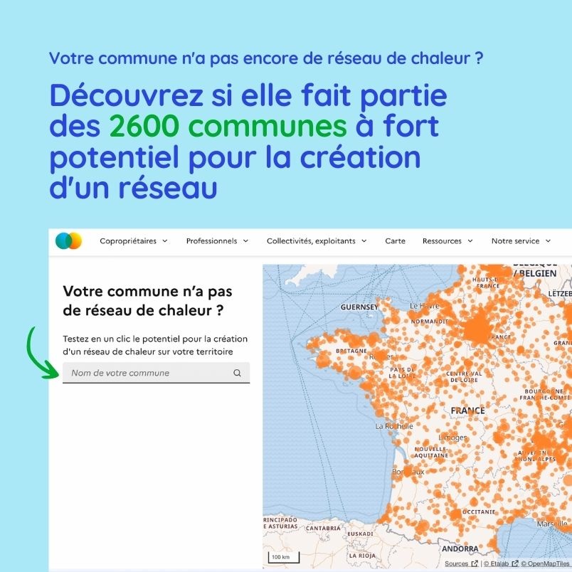
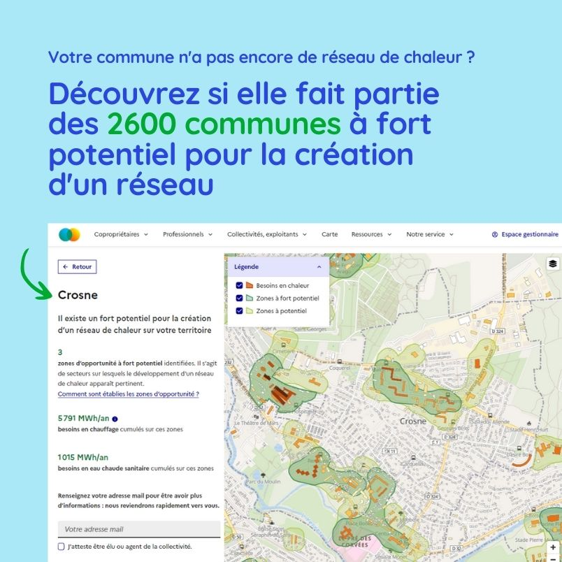

# 2600 communes à fort potentiel pour la création d'un réseau de chaleur : élus, testez la vôtre !

### **Un outil simple et innovant pour valoriser le potentiel des territoires**

France Chaleur Urbaine recense **2 600 communes disposant d’un fort potentiel pour la création de réseaux**, qui n’en sont pas encore équipées, ainsi que **4500 autres communes** sur lesquelles un potentiel non négligeable existe également.

Le [nouvel outil](https://france-chaleur-urbaine.beta.gouv.fr/collectivites-et-exploitants/potentiel-creation-reseau) dévoilé à l’occasion du salon des maires vise à sensibiliser et accompagner les élus dans la valorisation de ce potentiel.

Il suffit de renseigner le nom d’une commune pour visualiser les zones d’opportunité pour la création de réseaux de chaleur et identifier les principaux bâtiments susceptibles d’être raccordés (informations basées sur les modélisations réalisées par le Cerema, projet EnRezo). Les élus peuvent également demander à être recontactés pour obtenir plus d'informations ou bénéficier d’un accompagnement personnalisé.

### **Un levier efficace pour la décarbonation des bâtiments**

Les réseaux de chaleur permettent l’exploitation d’énergies renouvelables et de récupération (ENRR) locales, comme la géothermie, la biomasse ou encore la chaleur issue de l’incinération des déchets. Avec un taux moyen d’ENRR de 66,5 % et un contenu carbone deux à trois fois inférieur à celui des énergies fossiles, ces réseaux représentent l’un des leviers pour accélérer la transition énergétique des bâtiments.

La programmation pluriannuelle de l’énergie récemment mise en consultation vise à **multiplier par trois la chaleur livrée par ces réseaux d’ici 2035** (par rapport à 2022), tout en portant leur taux d’ENRR à 80 %. La création de nouveaux réseaux est donc nécessaire pour atteindre ces objectifs.

### **Un écosystème de soutien pour les collectivités**

**Un travail de sensibilisation est indispensable pour faire connaître le potentiel des territoires**, en particulier aux élus : c’est ce à quoi s’attachent France Chaleur Urbaine et ses partenaires. En complément du nouvel outil mis en ligne par France Chaleur Urbaine, un **réseau exclusivement ouvert aux collectivités, baptisé « les initiateurs de réseaux de chaleur et de froid »** a ainsi été récemment créé par un consortium d’acteurs sous le pilotage de l’Association Amorce (France Chaleur Urbaine, Ademe, l'AFPG, le Cerema, le CIBE et ENERPLAN) : il permet d’avoir toutes les clés en main pour monter sereinement un projet de réseau de chaleur sur son territoire (mise à disposition d’outils et ressources documentaires, partage de retours d’expérience, webinaires d’information…).

### **Un accompagnement tout au long de la vie du réseau**

Au-delà de la création de nouveaux réseaux de chaleur, il existe un **réel enjeu à développer les réseaux en service**, en multipliant les raccordements. **France Chaleur Urbaine est aussi aux côtés des collectivités dans cette phase**, avec un [ensemble de services gratuits](https://france-chaleur-urbaine.beta.gouv.fr/collectivites-et-exploitants/potentiel-creation-reseau) mis à leur disposition (données et outils pour faire connaître et planifier le développement du réseau, accompagnement dans la réalisation de campagnes de communication…).

<figure><figcaption></figcaption></figure>

 

<figure><figcaption></figcaption></figure>

