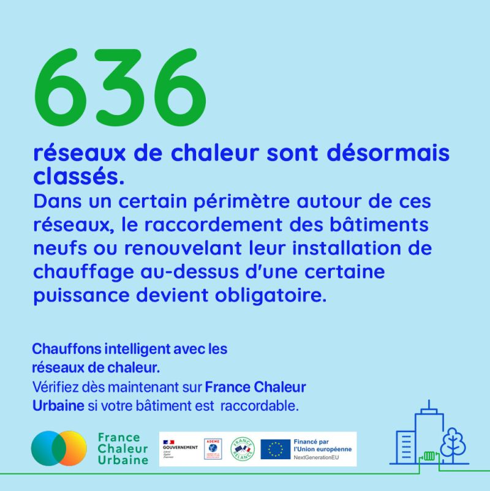

# 636 réseaux de chaleur classés

🔎 Saviez-vous que certains bâtiments ont désormais l'obligation de se raccorder à un réseau de chaleur ?

Cette obligation est instaurée par la procédure de classement du réseau de chaleur. Aujourd'hui, tous les réseaux de chaleur de service public ayant un taux d'énergies renouvelables de plus de 50%, un comptage de la chaleur livrée et dont l'équilibre financier est assuré sont automatiquement classés... et on en compte 636 en France !

👉 Concrètement, quels bâtiments sont concernés ?

Il s'agit des bâtiments neufs ou renouvelant leur installation de chauffage au dessus d'une certaine puissance, situés dans une zone autour du réseau de chaleur appelée "périmètre de développement prioritaire".

🗺 Comment connaître ou faire connaître le périmètre de développement prioritaire d'un réseau de chaleur ?

Rendez-vous sur la cartographie France Chaleur Urbaine !

<figure><figcaption></figcaption></figure>

