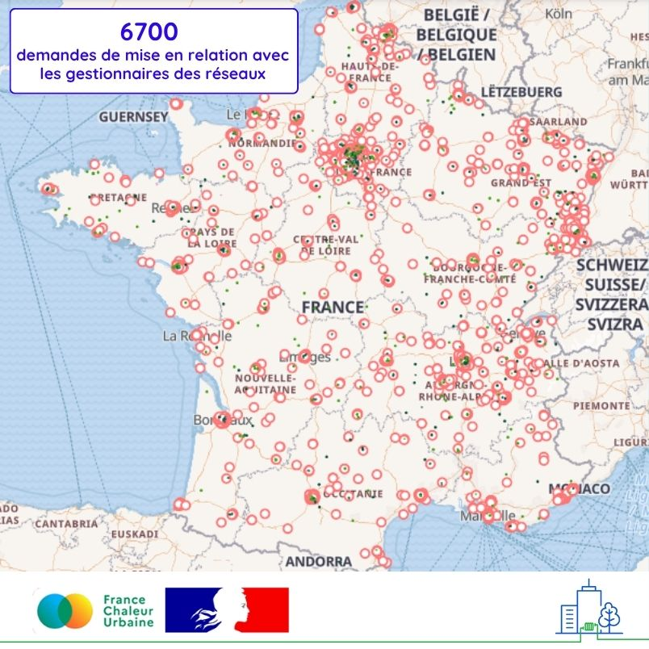

# 6700 demandes de mise en relation avec les gestionnaires des réseaux

🤝 6700 demandes de mise en relation avec les gestionnaires des réseaux de chaleur ont été déposées sur France Chaleur Urbaine depuis 2022, par des copropriétaires, bailleurs sociaux, gestionnaires de parcs tertiaires et bureaux d'études.

Ces demandes concernent majoritairement des bâtiments à proximité des réseaux, pour envisager des raccordements : 1800 raccordements sont à l'étude, en cours ou effectifs. Il est toutefois aussi possible de déposer des demandes pour des bâtiments éloignés de tout réseau : ces manifestations d'intérêt peuvent ainsi susciter ou alimenter des projets de nouveaux réseaux.

🏢 Pour les professionnels, France Chaleur Urbaine assure le dépôt de demandes groupées, afin que les raccordements puissent être envisagés en toute simplicité à l'échelle d'un parc de bâtiments : il suffit pour cela de nous contacter !

📍 L'ensemble des demandes est visible sur l'image ci-dessous, ou en version interactive sur notre carte en ligne (lien en commentaire).

Au-delà d'une plateforme numérique d'information sur les réseaux, France Chaleur Urbaine assure ainsi un véritable service à ses usagers !

<figure><figcaption></figcaption></figure>
