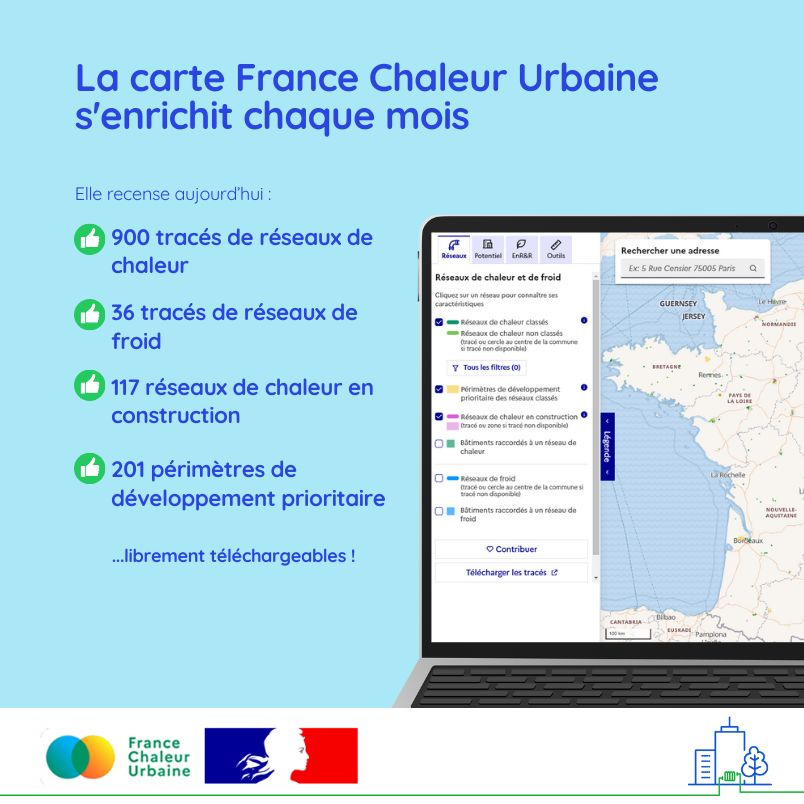

# 900 tracés de réseaux de chaleur recensés sur la carte !

🎉 Le seuil des 900 tracés de réseaux de chaleur recensés sur la [carte](/carte) France Chaleur Urbaine est franchi !\
\
Ce mois-ci encore, la carte s'est enrichie. Ont notamment été ajoutés :\
✅ 6 tracés de réseaux de chaleur en service, situés à Carhaix, La Gacilly, Asnières, Langueux, Lafrançaise, Toul\
✅ 9 réseaux en construction (nouveaux réseaux ou extensions), sur les territoires de Cannes, Toul, Ferney-Voltaire, Le Chesnay-Rocquencourt, Saint-Lô, Givors, Bonvillard, Issy-les-Moulineaux, Pontarlier\
✅ le périmètre de développement prioritaire du réseau de Chambéry, entré en vigueur au 1er juillet.\
\
Et comme chaque mois, vous pourrez retrouver les données actualisées en libre téléchargement sur [data.gouv.fr](/actus/nouveau-reseau-national-des-initiateurs-de-reseaux-de-chaleur-et-de-froid) !

<figure><figcaption></figcaption></figure>
