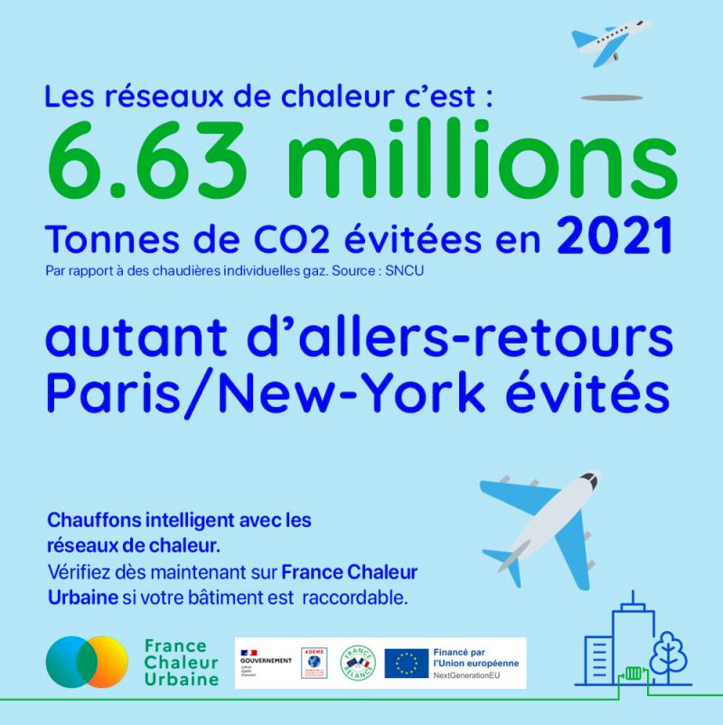

---
# 6,63 millions d'allers-retours Paris New-York évités

Les réseaux de chaleur sont un moyen concret et efficace de lutter contre le réchauffement climatique !

En 2021, l'émission de 6,63 millions de tonnes de CO2 a été évitée grâce aux réseaux de chaleur, l'équivalent d'autant d'allers-retours Paris / New-York en avion.

Chaque raccordement compte pour sortir de notre dépendance aux énergies fossiles.\
🛫 Alors décollage vers un avenir décarboné !

