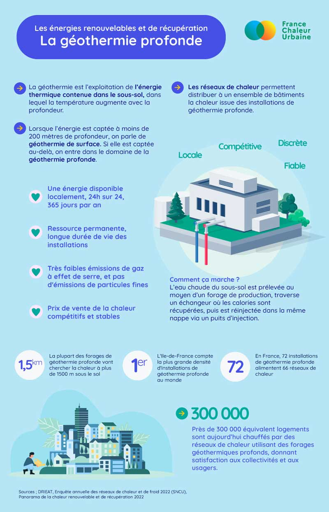

# La géothermie profonde

🤓 Toujours dans notre démarche de faciliter la compréhension par le grand public des réseaux de chaleur, nous entamons une série explicative sur les énergies renouvelables et de récupération qui alimentent les réseaux.\
\
1/ La [#géothermie](https://www.linkedin.com/feed/hashtag/?keywords=g%C3%A9othermie\&highlightedUpdateUrns=urn%3Ali%3Aactivity%3A7053986241528131584) profonde, qui ne représente aujourd'hui 5.5 % du mix énergétique des réseaux de chaleur, mais dont le potentiel de développement est important : pour atteindre l'objectif fixé par la programmation pluriannuelle de l'énergie à l'horizon 2028, il faudra plus que doubler la production actuelle ! Un objectif auquel doit contribuer le plan d'action pour la géothermie publié début février par le Gouvernement.\
\
🔎 La géothermie, de quoi parle-t-on ? Une fiche pédagogique pour rendre accessibles à tous les informations de base ci-dessous, à partager largement !

<figure><figcaption></figcaption></figure>
