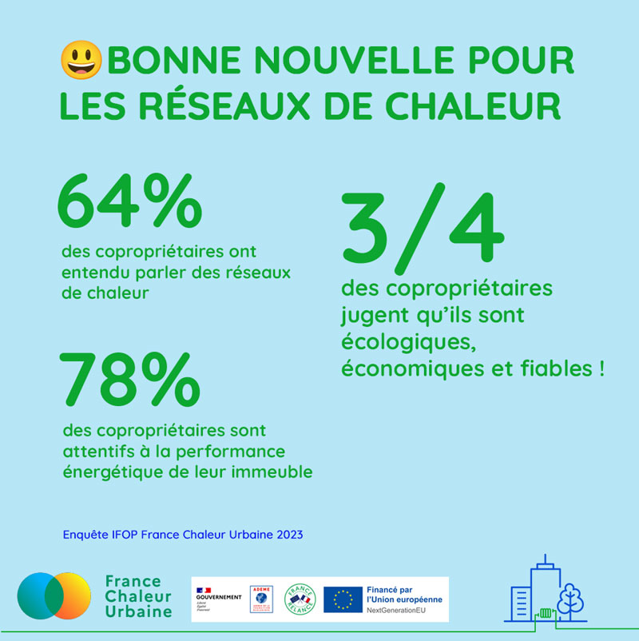

# Les chiffres de l'enquête IFOP 1

💡L'[enquête IFOP](https://france-chaleur-urbaine.beta.gouv.fr/documentation/enquete\_IFOP.pdf) récemment menée pour France Chaleur Urbaine nous éclaire sur l'opinion des copropriétaires à propos des réseaux de chaleur. Ces informations sont précieuses pour orienter notre stratégie mais aussi pour comprendre les marges de progression à un niveau plus large. Il nous semble donc important de communiquer sur les chiffres les plus manquants.

\
😃 Commençons par les bonnes nouvelles !

