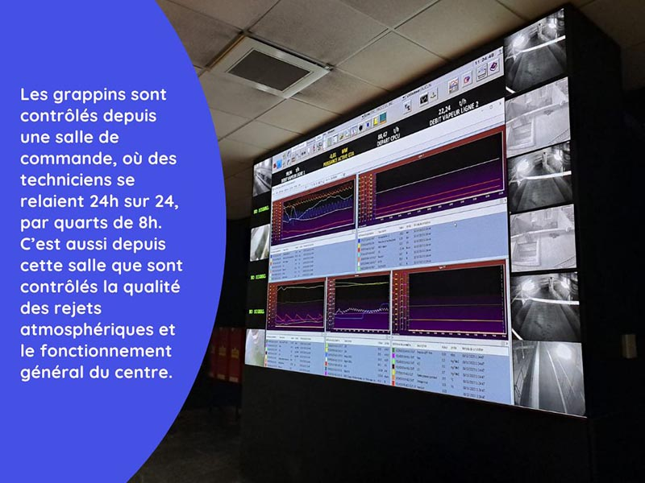
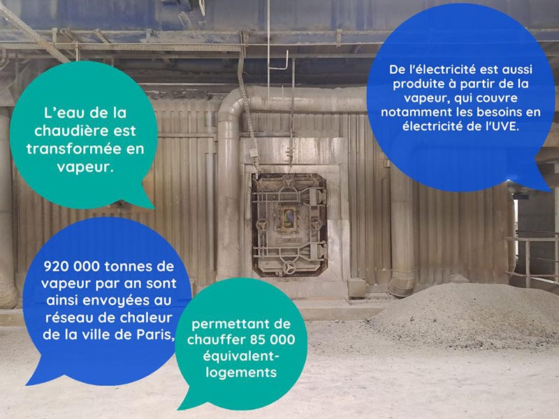
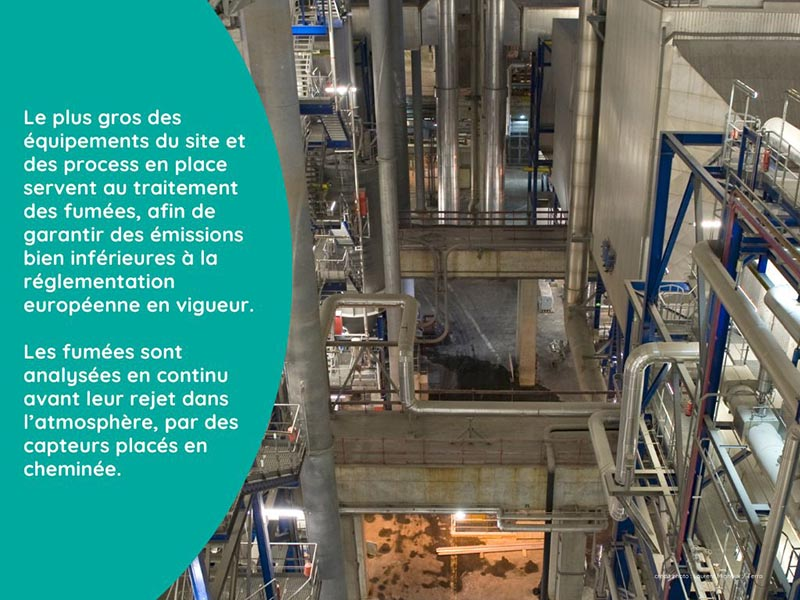
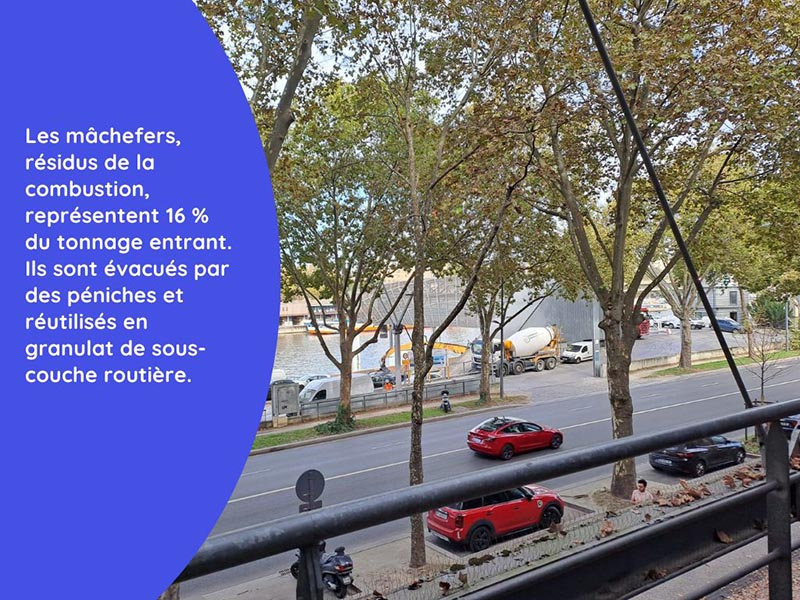

# Visite de l'unité de valorisation énergétique Isséane

Pour découvrir les installations qui alimentent les réseaux de chaleur, direction Issy-les-Moulineaux !\
\
♨ Nous vous emmenons visiter l'unité de valorisation énergétique Isséane du [Syctom](https://www.syctom-paris.fr/accueil.html). Grâce à ses trois unités de valorisation énergétique (UVE), traitant les déchets de 5,7 millions d'habitants, le Syctom produit chaque année 3,5 millions de tonnes de vapeur qui viennent alimenter le réseau de chaleur de la Ville de Paris, géré par la CPCU. La chaleur issue de ces UVE représente ainsi plus de 40% du mix énergétique du réseau parisien et chauffe près de 300 000 équivalent-logements.\
\
Mise en service en 2007, Isséane est la plus récente de ces trois UVE. La suite en images ci-dessous ! 👇

.jpg>)\
.jpg>)

.jpg>)

.jpg>)

.jpg>)

