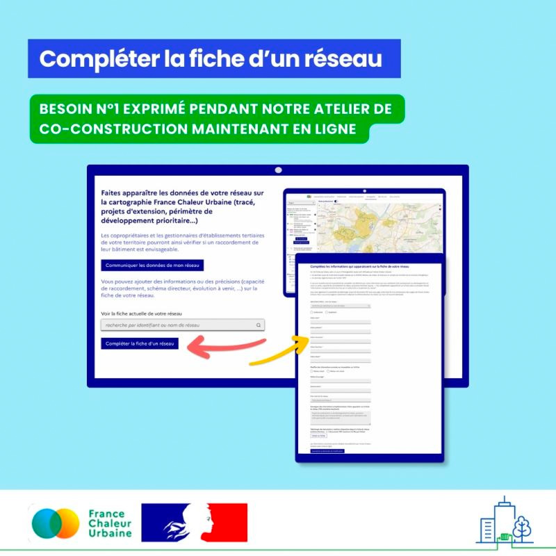

# Compléter la fiche de votre réseau

📢 Collectivités, exploitants : vous pouvez désormais compléter la fiche de votre réseau de chaleur en ligne sur France Chaleur Urbaine ! Il s'agissait du besoin n°1 exprimé lors de notre dernier atelier de co-construction.\
\
Dans un souci d'homogénéité, les fiches accessibles depuis notre cartographie sont alimentées par les données de l'enquête annuelle réalisée par la FEDENE pour le compte du SDES : l'année de référence est ainsi la même pour tous les réseaux.\
\
📝 Votre réseau vient d'être verdi ou va l'être prochainement ? Faites le savoir ! Il vous est également possible d'utiliser cette fiche pour informer sur les futurs développements du réseaux, les critères de raccordement ou toute autre information utile. Vous souhaitez partager un document via cette fiche ? C'est aussi possible ! Nous vous encourageons notamment à partager vos schémas directeurs, qui nous sont souvent demandés par les usagers professionnels de France Chaleur Urbaine (bailleurs sociaux, gestionnaires de parcs tertiaires...).\
\
👉 Concrètement, comment ça marche ? Un [formulaire](https://france-chaleur-urbaine.beta.gouv.fr/reseaux/modifier) vous permet de corriger ou compléter les informations de votre fiche. Après une validation manuelle par notre équipe, vos ajouts apparaîtront dans une rubrique dédiée de la fiche.

