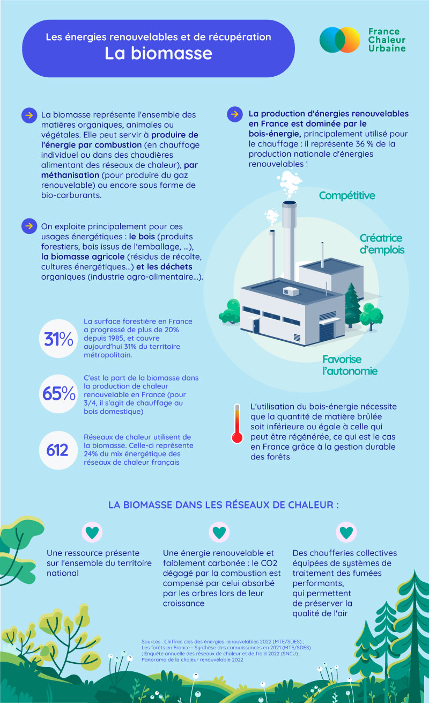

# La biomasse

🤓 N° 2 dans notre série sur les énergies renouvelables et de récupération qui alimentent les réseaux de chaleur : la biomasse, qui reste la principale source d'énergie renouvelable dans notre pays.&#x20;

🌳 Il s'agit d'une ressource abondante en France, qui favorise l'autonomie des territoires et permet le développement d'une économie circulaire. L'usage de la biomasse pour l'énergie est amené à se développer fortement, sur la base de ressources issues d'une gestion durable, en bonne articulation avec les usages autres qu'énergétiques, et en limitant son impact en termes de qualité de l'air grâce à des installations performantes.&#x20;

🔎 Pour comprendre l'essentiel en un coup d’œil, notre fiche pédagogique, toujours à partager largement !

<figure><figcaption></figcaption></figure>
