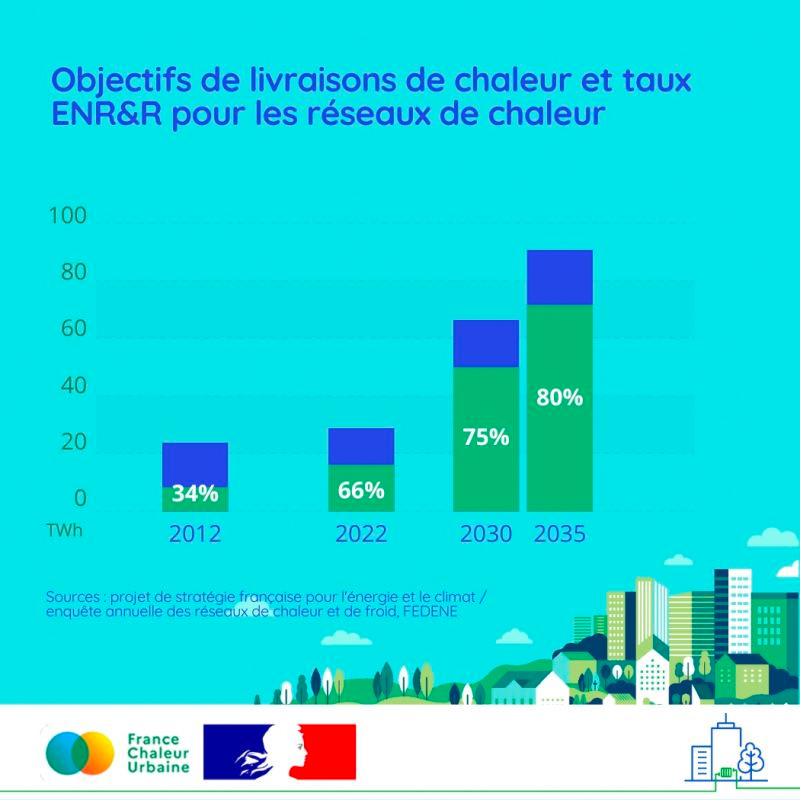

# 80% d'énergies renouvelables et de récupération

🌿 80% d'énergies renouvelables et de récupération dans les réseaux de chaleur en 2035, vous y croyez ? Nous, oui !\
\
🎯 En 10 ans, ce taux est passé de 34% à plus de 66%. Le projet de Stratégie française pour l'énergie et le climat fixe pour objectif d'atteindre 75% d'ENR\&R dans les réseaux en 2030, et 80% en 2035. Non seulement, ce taux devra significativement augmenter, mais les livraisons de chaleur totales devront être multipliées par un facteur 3, pour atteindre 90 TWh en 2035. Des objectifs ambitieux... à la hauteur du potentiel que représentent les réseaux de chaleur pour la décarbonation du bâtiment !

