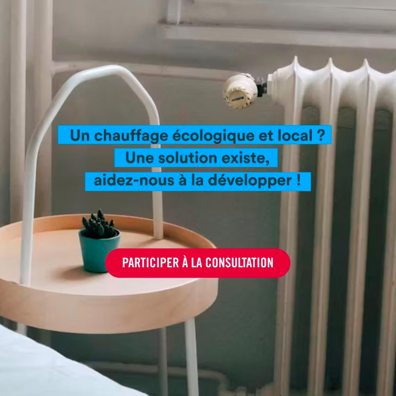

# Une concertation nationale sur le chauffage urbain

Parce qu'il nous apparaît essentiel d'être au contact des citoyens, des prospects et des usagers du chauffage urbain, nous sommes très heureux d'avoir été associés à la réalisation de la concertation nationale lancée par [ENGIE Solutions France](https://www.engie-solutions.com/fr) intitulée "Un chauffage écologique et local ? Une solution existe, aidez-nous à la développer !"\
\
🎯 Les objectifs de cette concertation sont triples :\
✔ informer le grand public sur ce mode de chauffage encore trop peu connu\
✔ comprendre comment les réseaux de chaleur sont aujourd'hui perçus\
✔ recueillir des idées pour les développer, notamment pour les faire mieux connaître et adopter.\
\
Les retombées de cette concertation pourront être utiles à l'ensemble de la filière.\
\
👉 Nous vous encourageons donc à partager largement le lien permettant d'y répondre ! [https://bit.ly/48aTPzf](https://bit.ly/48aTPzf)

