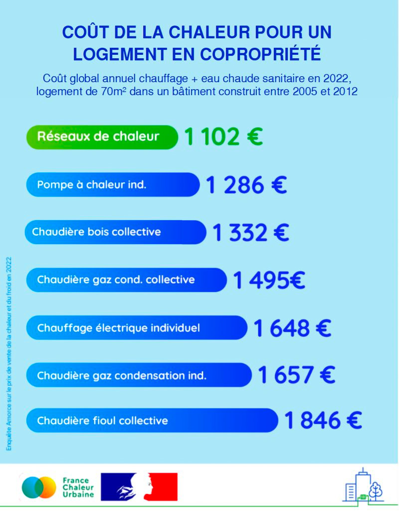

# Comparaison du coût de la chaleur pour un logement en copropriété

💸 Le chauffage urbain constitue en moyenne la solution de chauffage la plus compétitive pour les logements collectifs !\
\
👉 C'est ce que conclut la nouvelle enquête annuelle Amorce / ADEME sur le prix de vente de la chaleur et du froid, portant sur l'année 2022. Et la différence est significative : par rapport à une chaudière collective au fioul, la facture globale annuelle est réduite de 40 %.\
\
🔎 La figure ci-dessous illustre le coût global annuel chauffage + eau chaude sanitaire pour un logement de 70 m² dans un immeuble construit entre 2005 et 2012 (RT2005). Les aides à l'investissement et à l'achat d'énergie (chèque énergie, gel du tarif réglementé, bouclier tarifaire...) ont été déduites : c'est donc le prix le plus proche de celui payé par l'usager qui est représenté.

