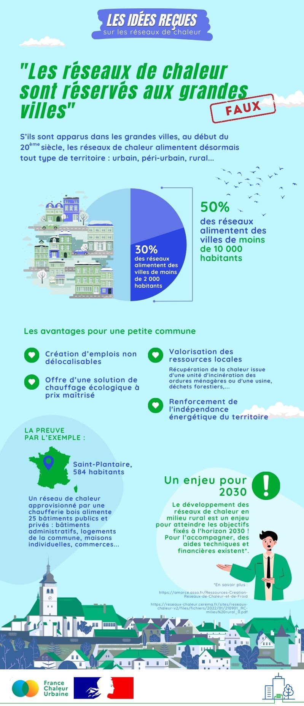

# Les réseaux de chaleur : plus si urbains que ça !

🤔 Démêler le vrai du faux : pourquoi il est essentiel de lutter contre les idées reçues sur les réseaux de chaleur.\
\
🌿 Sur les énergies renouvelables en général, et les réseaux de chaleur en particulier, de nombreuses idées reçues circulent. Ces préjugés peuvent freiner le développement de ces solutions écologiques en décourageant les particuliers, collectivités et entreprises de les adopter. Il est donc crucial de faire la lumière sur ces sujets de manière claire et précise !\
\
👉 C'est tout l'objet de notre nouvelle série d'infographies : répondre aux idées reçues les plus fréquentes de manière simple et attractive, sur la base de données factuelles.\
\
Rejoignez-nous dans cette démarche en partageant ces infographies autour de vous ! 🌍

<figure><figcaption></figcaption></figure>
