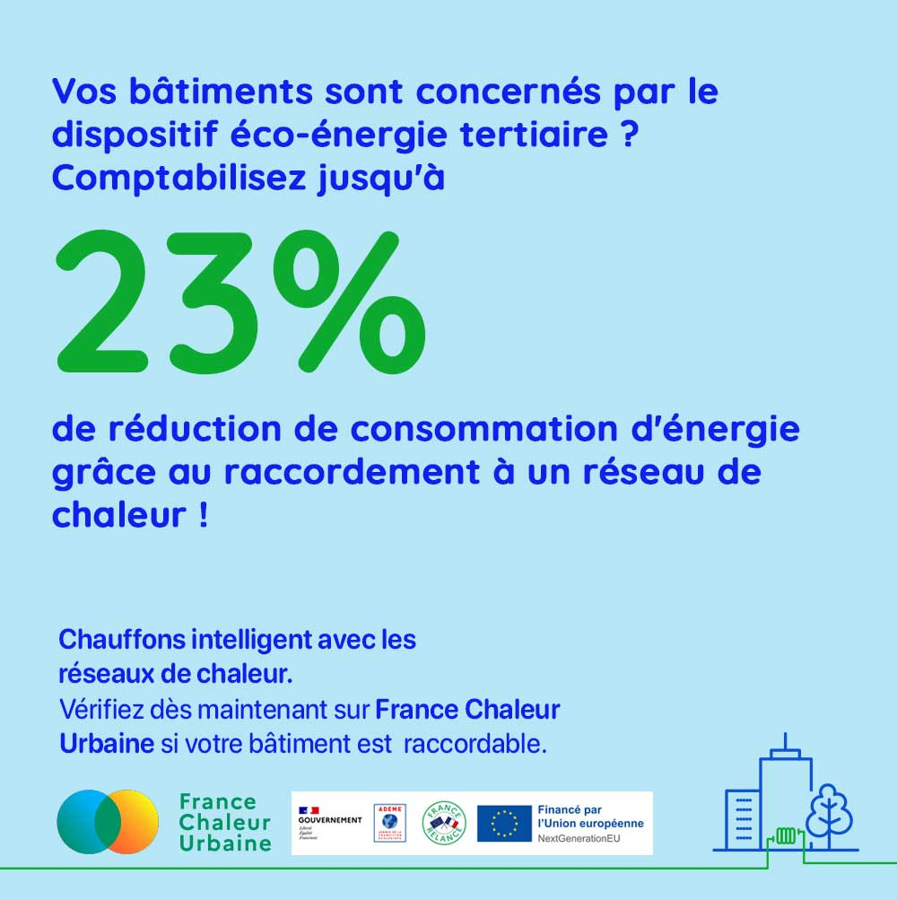

# Dispositif éco-énergie tertiaire

Vous êtes propriétaire ou gestionnaire de bâtiments tertiaires d'une surface (ou d'un cumul de surfaces) égale ou supérieure à 1 000 m² ?

👉 Ces bâtiments sont assujettis au dispositif éco-énergie tertiaire. Leurs consommations d’énergie finale devront être réduites de 40% en 2030, 50% en 2040 et 60% en 2050.

Pour atteindre les objectifs du dispositif, vous pouvez optimiser l'exploitation de vos bâtiments, moderniser vos équipements, ou encore engager des travaux de rénovation énergétique.

Vous pouvez aussi opter pour un raccordement à un réseau de chaleur !

🎯 Grâce au jeu des coefficients de conversion en énergie finale, jusqu'à 23% de réduction de consommation peuvent être comptabilisées rien qu'en raccordant vos bâtiments à un réseau de chaleur.

Avec le coup de pouce chauffage des bâtiments résidentiels collectifs et tertiaires, le coût du raccordement est fortement réduit.

🔎 Rendez-vous sans attendre sur France Chaleur Urbaine pour vérifier si un réseau de chaleur se situe à proximité de votre parc tertiaire !

