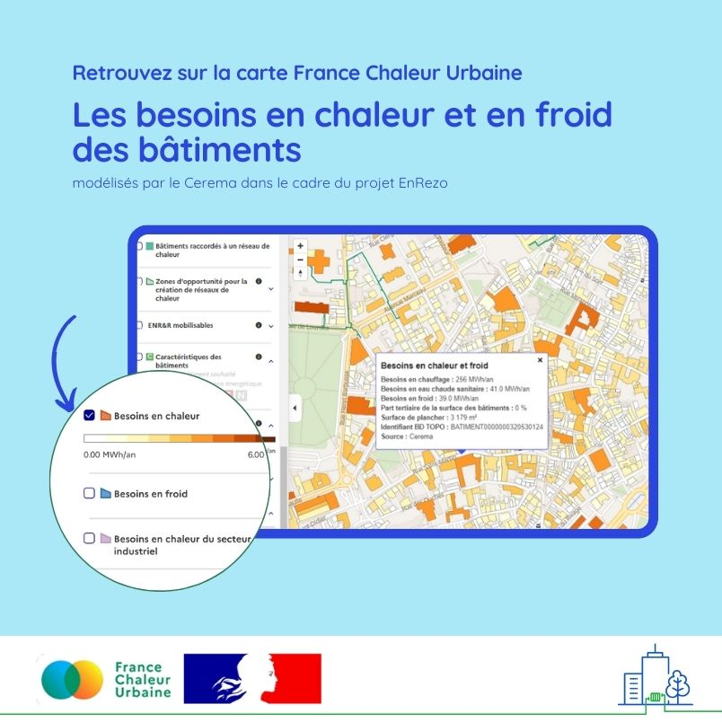

# Identifier les besoins en chaleur des bâtiments

📢 Nouveauté sur France Chaleur Urbaine : retrouvez les besoins en chaleur des bâtiments, modélisés par le [Cerema](https://www.cerema.fr/fr) dans le cadre du projet [EnRezo](https://reseaux-chaleur.cerema.fr/espace-documentaire/enrezo) !\
\
🔧 En attendant de se refaire une beauté pour la rentrée (avec une meilleure structuration de l'information, pour s'y retrouver plus facilement), la [carte France Chaleur Urbaine](https://france-chaleur-urbaine.beta.gouv.fr/carte) offre ainsi un outil encore plus complet pour évaluer les potentiels de raccordement aux réseaux de chaleur, en permettant d'accéder simultanément à plusieurs bases de données complémentaires :\
\
✅ les consommations de gaz à l'adresse, pour repérer les gros consommateurs d'un territoire (données réelles pour l'année 2022 - source SDES) ;\
✅ l'identification des bâtiments à chauffage collectif au gaz ou fioul, les plus facilement raccordables (données issues de la Base de données nationale des bâtiments du CSTB et du Registre national d'immatriculation des copropriétés de l'Anah) ;\
✅ les besoins en chaleur des bâtiments, modélisés par le Cerema sur la base des caractéristiques des bâtiments (fichiers fonciers, BD Topo), qui permettent d'avoir une estimation pour la totalité des bâtiments résidentiels et tertiaires en France. A noter que les besoins en froid sont également diffusés ;\
✅ les caractéristiques des bâtiments issues de différentes sources : usage, surface de plancher, nombre de logements, année de construction, DPE estimé...\
\
En complément, sont aussi diffusés sur France Chaleur Urbaine les besoins en chaleur du secteur industriel à la maille communale, également modélisés par le Cerema.

<figure><figcaption></figcaption></figure>

