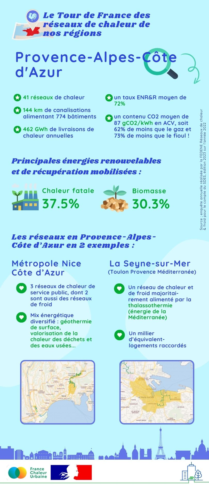

# Les réseaux de chaleur en région : focus sur la Provence-Alpes-Côte d'Azur

🚴‍♂️ Pour la sixième étape de notre tour de France des réseaux de chaleur, nous partons en [Région Sud - Provence-Alpes-Côte d'Azur](https://www.maregionsud.fr/).\
\
🔎 La région compte 41 réseaux de chaleur, dont 5 assurent également la fourniture de froid. Ces derniers sont en réalité des boucles d'eau tempérée : un fluide à basse température circule dans le réseau, dont la température est rehaussée ou abaissée grâce à des pompes à chaleur en bas d'immeuble. Ces boucles mobilisent différentes sources d'énergie, notamment la géothermie de surface, mais aussi la thalassothermie, c'est-à-dire l'exploitation des calories de la mer. C'est par exemple le cas du réseau de la Seyne-sur-Mer ([Toulon Provence Méditerranée](https://metropoletpm.fr/)), qui fut le premier réseau français à valoriser l'énergie de la Méditerranée, ou encore du réseau aujourd'hui en cours de création à Port-de-Bouc.\
\
🤓 Quelques chiffres clés sur les réseaux de la région Provence-Alpes-Côte d'Azur ci-dessous !

<figure><figcaption></figcaption></figure>

