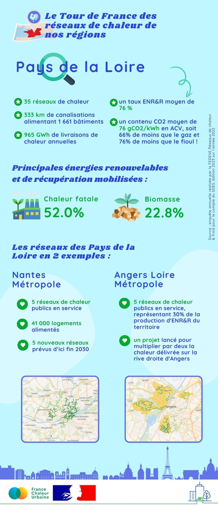

# Les réseaux de chaleur en région : focus sur les Pays de la Loire

🚴‍♂️ Aujourd'hui, notre tour de France des réseaux de chaleur en région nous emmène en [Région Pays de la Loire](https://www.paysdelaloire.fr/).\
\
🔎 Le nombre de réseaux de chaleur de la région a presque triplé en dix ans, passant de 12 réseaux de chaleur en 2012 à 35 en 2022. Leur taux d'énergies renouvelables et de récupération a aussi fortement progressé, augmentant de 34% en 2012 à 76% en 2022. Les grandes agglomérations de la région disposent déjà chacune de plusieurs réseaux, qu'elles continuent de développer, avec des projets ambitieux. C'est notamment le cas sur les territoires de [Nantes Métropole](https://metropole.nantes.fr/), [Angers Loire Métropole](https://www.angersloiremetropole.fr/) ou encore [Le Mans Ville et Métropole](https://www.lemansmetropole.fr/).\
\
Les réseaux de chaleur de la région Pays de la Loire en quelques chiffres clés, c'est ici ! 👇

<figure><figcaption></figcaption></figure>
