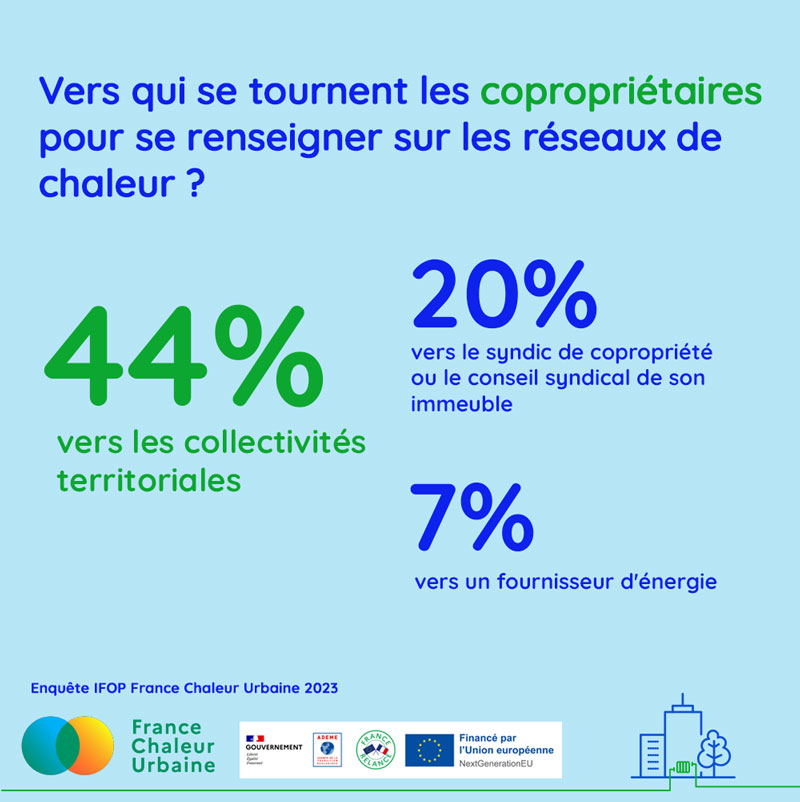

# Les chiffres de l'enquête IFOP 3

Toujours grâce à [l'enquête IFOP](https://france-chaleur-urbaine.beta.gouv.fr/documentation/enquete\_IFOP.pdf\*) pour France Chaleur Urbaine sur les copropriétaires et les réseaux de chaleur, on découvre que ce sont bien les collectivités qui sont identifiées comme la porte d'entrée pour obtenir des informations.

\
France Chaleur Urbaine s'est justement fixé pour mission de les aider à faire connaître leur réseaux de chaleur, en mettant à leur disposition :\
👉 une [cartographie](https://france-chaleur-urbaine.beta.gouv.fr/carte) interactive pour faire connaître les tracés de leurs réseaux, projets d’extension, périmètres de développement prioritaire... désormais intégrable sur tout site internet\
👉 des [éléments pour communiquer](https://france-chaleur-urbaine.beta.gouv.fr/ressources/supports#contenu) auprès du grand public : kit de communication, campagne de pub...\
France Chaleur Urbaine c'est aussi un espace gestionnaire partagé accessible aux collectivités et exploitants, pour retrouver l'ensemble des demandes reçues sur leurs réseaux.

\
🤝 Collectivités, n'hésitez pas à nous contacter pour découvrir tout ce que France Chaleur Urbaine peut faire pour vous !

