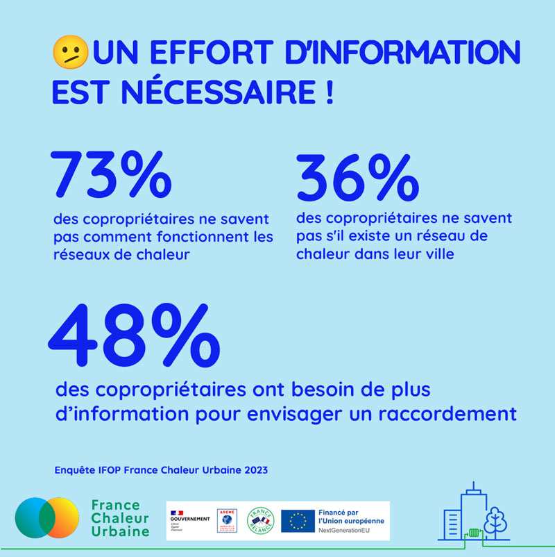

# Les chiffres de l'enquête IFOP 2

💡 Pour continuer sur les résultats de l'[enquête IFOP](https://france-chaleur-urbaine.beta.gouv.fr/documentation/enquete\_IFOP.pdf) menée pour France Chaleur Urbaine, nous vous partageons ici des chiffres qui témoignent de la nécessité de mieux faire connaître les réseaux de chaleur. Communiquer et Informer sont les mots d'ordre à retenir pour orienter les copropriétaires vers un choix vertueux pour leur mode de chauffage !

