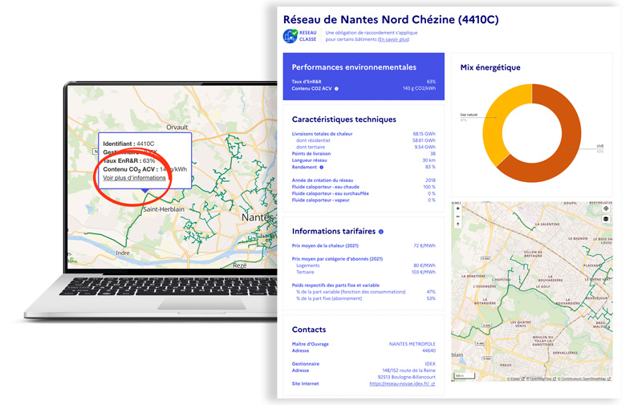

# Des informations techniques et tarifaires par réseau

🔎 Vous recherchez des informations sur un réseau de chaleur ? France Chaleur Urbaine s'est récemment enrichi de fiches par réseau rassemblant de nombreuses informations techniques (mix énergétique, livraisons annuelles du réseau, longueur...), mais aussi des informations tarifaires pour les réseaux classés : une première pour la filière ! De quoi accélérer le développement des réseaux et aider les bureaux d'étude, bailleurs sociaux, collectivités,..., dans leurs missions.\
\
Les données, qui portent actuellement sur l'année 2021, seront actualisées suite à la publication des résultats de la prochaine enquête annuelle réalisée par le SNCU.\
\
👉 Vous souhaitez accéder à ces fiches ? Il vous suffit pour cela de cliquer sur le réseau concerné sur notre carte, puis sur "Voir plus d'informations".\
\
Un grand merci à nos partenaires, et en particulier Via Sèva et le SNCU, sans qui cette diffusion n'aurait pas été possible.

