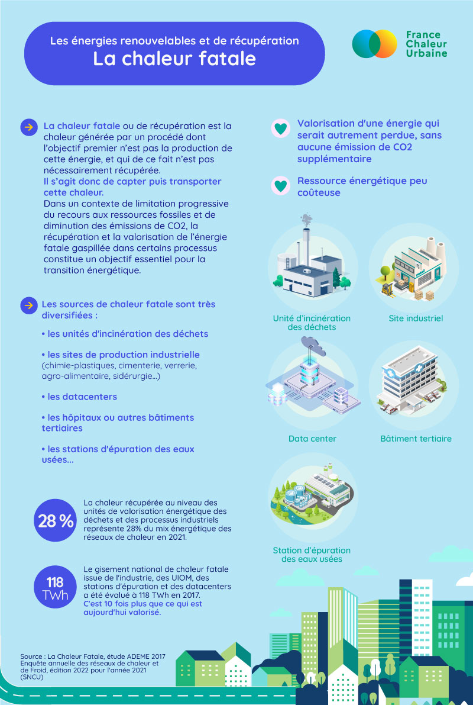

# La chaleur fatale

N° 3 dans notre série sur les énergies renouvelables et de récupération qui alimentent les réseaux de chaleur : la chaleur fatale.&#x20;

⌨️ La chaleur fatale ou "chaleur de récupération" désigne la chaleur inéluctablement rejetée par un procédé dont ce n'est pas la vocation première. Les réseaux de chaleur constituent l'un des seuls moyens de récupérer et valoriser cette énergie qui serait autrement perdue, sans générer aucune émission de CO2 additionnelle ! Aujourd'hui, les innovations techniques permettent d'exploiter des sources de chaleur fatale de plus en plus variées. L'enjeu est de taille pour décarboner nos modes de chauffage.&#x20;

👉 Comme d’habitude avec nos infographies : comprendre l’essentiel en un coup d'œil. A partager largement !

