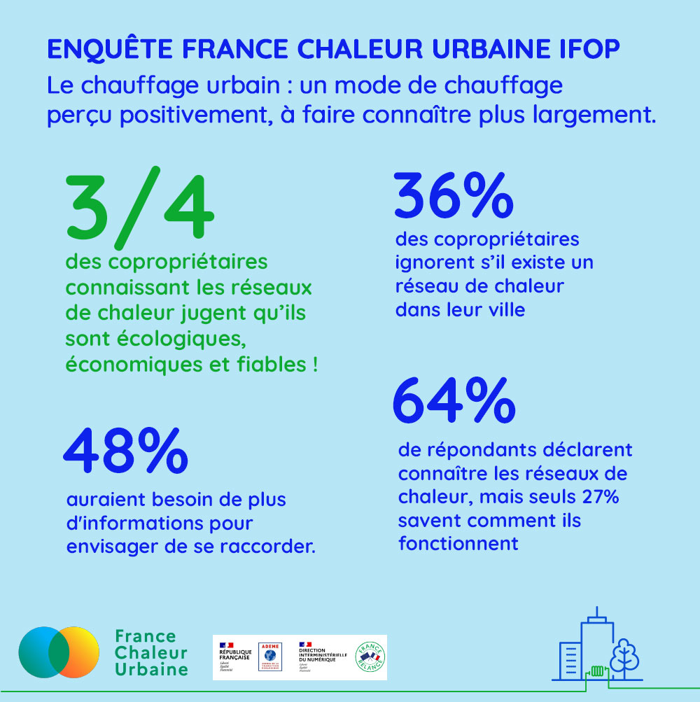

# L'enquête IFOP pour France Chaleur Urbaine

### Un levier incontournable de la transition énergétique encore mal connu

**Les réseaux de chaleur sont-ils connus des copropriétaires, principaux concernés par ce mode de chauffage adapté aux bâtiments collectifs ? Comment sont-ils perçus ? De manière plus générale, quels sont les critères qui prédominent lors du changement de chauffage en copropriété ?**

**La décarbonation du secteur du bâtiment**, responsable de \*_**18% des émissions de gaz à effet de serre nationale, est l’une des priorités pour faire face à l’urgence climatique et à la crise énergétique. Le Gouvernement vient de lancer une concertation nationale**_** pour préparer et accélérer cette décarbonation. L’un des leviers identifiés est le remplacement des chaudières fossiles par des modes de chauffage moins carbonés, avec par exemple le raccordement à des réseaux de chaleur. Le Secrétariat général à la planification écologique prévoit ainsi que les réseaux de chaleur constitueront dans les années à venir “un vecteur très important du développement de la chaleur renouvelable”, avec un doublement du nombre de raccordements annuels attendu, soit jusqu’à 360 000 logements raccordés par an.**

Afin de mieux comprendre les leviers d’accélération des raccordements aux réseaux de chaleur, France Chaleur Urbaine a missionné l’IFOP pour la réalisation d’une enquête, réalisée auprès d’un échantillon représentatif de la population française propriétaire d’un appartement au sein d’une commune de plus de 10 000 habitants.

**3 grands enseignements** en ressortent :

* Les copropriétaires enquêtés ont une très bonne image des réseaux de chaleur : sur les **64% des répondants qui ont entendu parler des réseaux de chaleur,** 75% d’entre eux pensent qu’il s’agit d’un mode de chauffage **économique, écologique et fiable.**
* **En revanche, seuls 27% des répondants savent précisément comment fonctionne un réseau de chaleur.** 23% seraient prêts à envisager un raccordement à un réseau de chaleur et à en parler au conseil syndical de leur immeuble, mais **48% se montrent indécis en raison de leur manque d’informations sur le sujet**. Ainsi, le raccordement à un réseau de chaleur peut séduire les propriétaires devant changer de mode de chauffage, à condition qu’ils soient mieux informés.
* **L’importance attachée à l’impact écologique lors du changement de mode de chauffage** **est moindre que celle accordée au prix** : interrogés sur les critères prédominants lors du changement de leur mode de chauffage, 68% des répondants mentionnent le coût de l’énergie et 37% le coût des travaux pour le changement de chauffage. Ne sont mentionnés que de manière plus secondaire le confort de chauffe au quotidien (28%), puis l’impact écologique (21%) et la sécurité de l’installation (17%). La fiabilité de l’approvisionnement ne joue quant à elle un rôle déterminant que pour un petit nombre de copropriétaires (8%).

**→ En conclusion, afin de faire basculer la décision en faveur d’un réseau de chaleur lors d’un changement de mode de chauffage, l’information et la pédagogie sont des leviers cruciaux.** La transition écologique et énergétique doit se faire en accompagnant, en rassurant et en démontrant à chaque étape l’intérêt pour la copropriété de se raccorder. Les tarifs compétitifs offerts par les réseaux de chaleur, qui exploitent des énergies renouvelables et de récupération locales, et les aides financières disponibles pour les raccordements, peuvent répondre aux inquiétudes exprimées par les copropriétaires sur les critères économiques.

Le service public [**France Chaleur Urbaine**](https://france-chaleur-urbaine.beta.gouv.fr/) a pour mission d’informer le grand public afin de faciliter les raccordements. Il se place en tiers de confiance entre les copropriétaires et les gestionnaires des réseaux et permet à chacun de déterminer **en quelques clics si un raccordement est envisageable pour son immeuble** et le cas échéant **d’être mis en relation, gratuitement et sans engagement, avec le bon interlocuteur pour concrétiser le raccordement.**

> **CTA : Consultez l'enquête**&#x20;

.jpg>)
