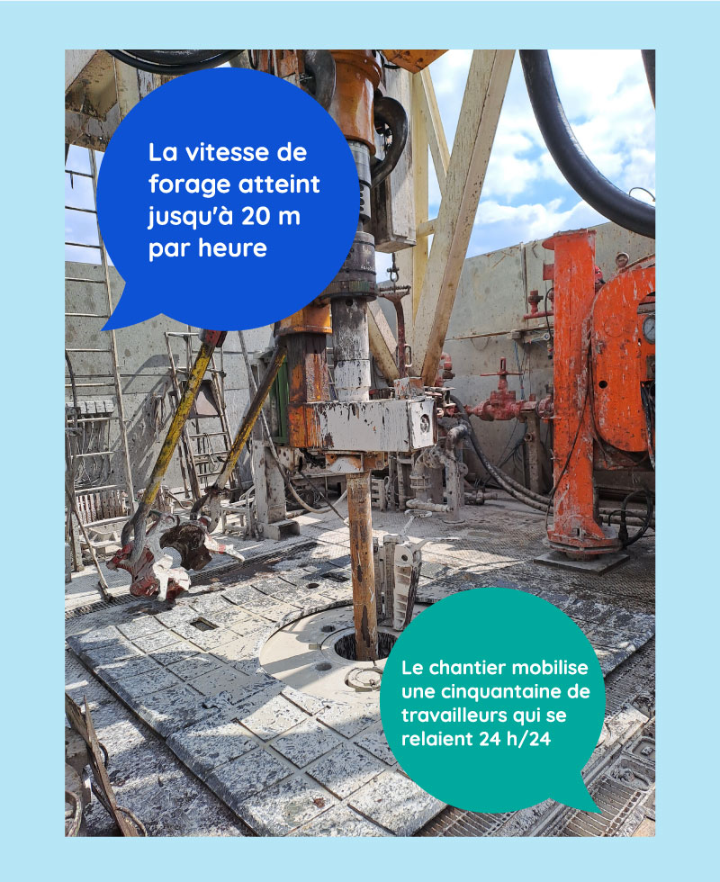

# Visite d'un forage de géothermie

Pour illustrer en images la géothermie profonde, dont nous vous parlions dans notre dernier post, direction Champigny-sur-Marne (94) !

Ce mardi, l'équipe France Chaleur Urbaine était sur le forage débuté mi-février, qui permettra d'ici mi-mai d'atteindre la nappe du Dogger dont la température avoisine les 70°C. Un réseau de chaleur de 9 km permettra ensuite d'acheminer la chaleur géothermique vers 52 postes de livraison.

Un grand merci à [Coriance](https://groupe-coriance.fr/) pour l'organisation de cette visite.

.jpg>).jpg>)
