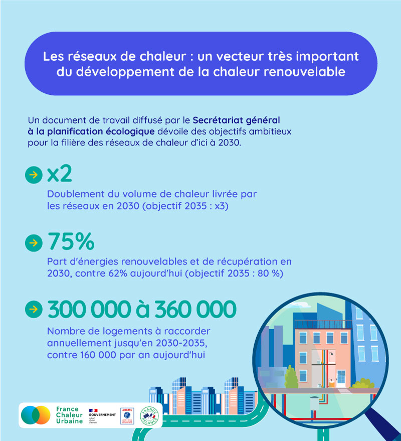

# Préparation de la loi de programmation sur l'énergie et le climat

Quelle place pour les réseaux de chaleur dans la politique énergétique française ?\

Le secrétariat général à la planification écologique a récemment diffusé un [document de travail](https://www.gouvernement.fr/upload/media/content/0001/06/3a74943433702a0247ca9f7190177a37710a9678.pdf), établi dans le cadre de la préparation de la loi de programmation sur l'énergie et le climat attendue à l'automne.

\
Les réseaux de chaleur y sont décrits comme "un vecteur très important du développement de la chaleur renouvelable", avec des objectifs ambitieux envisagés👇

