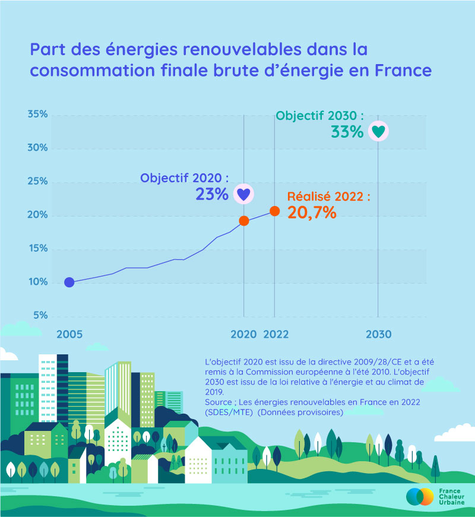

# Part des énergies renouvelables dans la consommation finale brute d’énergie en France

Suite à la récente publication du service données et statistiques du [Ministères Écologie Énergie Territoires](https://www.linkedin.com/company/ministere-de-la-transition-ecologique/) sur les énergies renouvelables en France, on peut se féliciter de voir qu'elles occupent une part croissante dans la consommation finale brute d'énergie en 2022. Cette part progresse de +1,4 points par rapport à 2021, atteignant ainsi 20,7 %. Cependant l’objectif 2020 issu des directives européennes n'est toujours pas atteint puisqu’il fixait cette part à 23% ! Un effort à fortement renforcer pour atteindre les 33% fixés par la loi énergie climat pour #2030...

<figure><figcaption></figcaption></figure>
