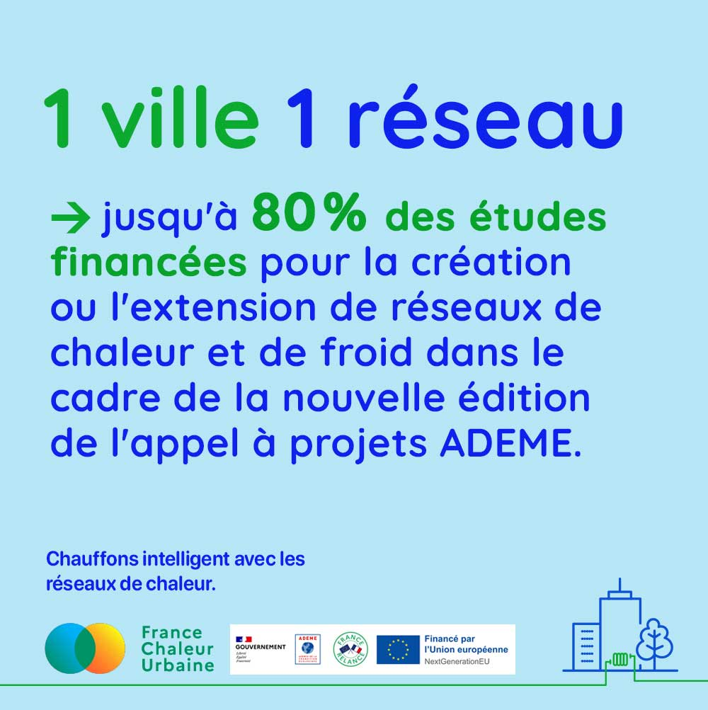
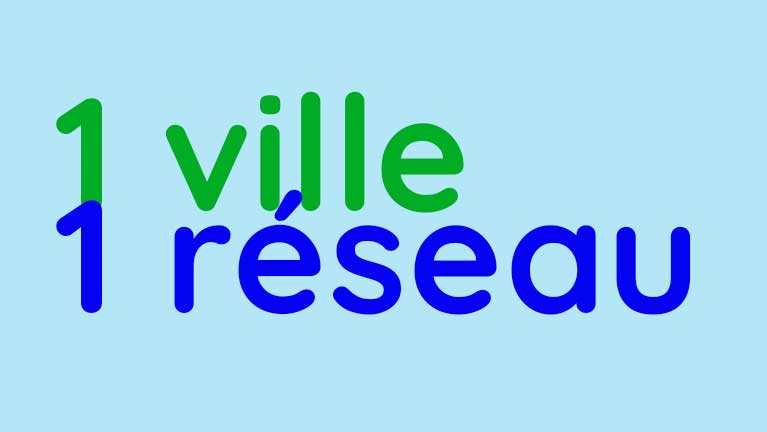

# L'appel à projets 1 ville 1 réseau de l'ADEME est relancé

Les réseaux de chaleur ne sont pas réservés aux grandes villes !

Votre collectivité couvre une population inférieure à 50 000 habitants et vous envisagez la création d'un réseau de chaleur ou de froid sur votre territoire ?

L'ADEME relance son appel à projets "Une ville, un réseau", avec un financement des études allant jusqu'à 80 % ! Cette seconde édition est ouverte jusqu'au 15 septembre 2023.

Retrouvez l'appel à projets ici :&#x20;

[https://agirpourlatransition.ademe.fr/entreprises/aides-financieres/20230306/etudes-reseaux-chaleur-renouvelables-2-edition-jusqua-80-etudes?cible=78](https://agirpourlatransition.ademe.fr/entreprises/aides-financieres/20230306/etudes-reseaux-chaleur-renouvelables-2-edition-jusqua-80-etudes?cible=78)

<figure><figcaption></figcaption></figure>

<figure><figcaption></figcaption></figure>

