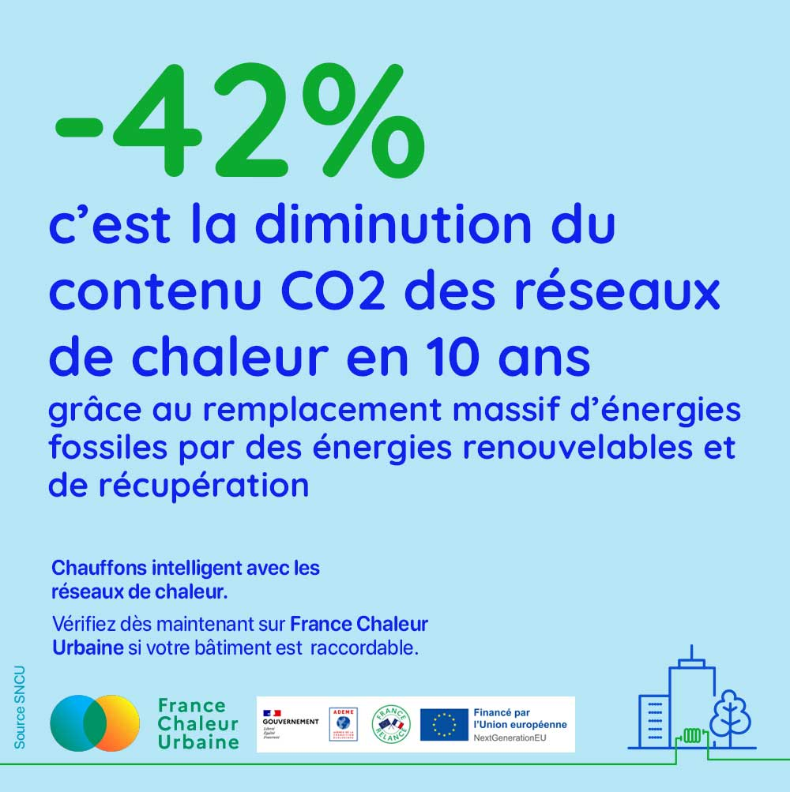

# La décarbonation des réseaux de chaleur est en marche !

↘ En 10 ans, les émissions de CO2 associées au chauffage urbain ont diminué de 42%. Aujourd'hui, elles s'élèvent à 125 g CO2 ACV/kWh seulement, contre 227 g CO2/kWh pour le gaz et 324 gCO2/kWh pour le fioul.\
\
🎯 Et ce n'est pas fini ! Objectif ? Réduire encore ces émissions de 33% dès 2030, grâce au remplacement massif des énergies fossiles par des énergies renouvelables et de récupération... et atteindre la neutralité carbone en 2050.\
\
Source : enquête annuelle des réseaux de chaleur et de froid réalisée par la [FEDENE](https://www.linkedin.com/company/fedene/) (édition 2022)

<figure><figcaption></figcaption></figure>

