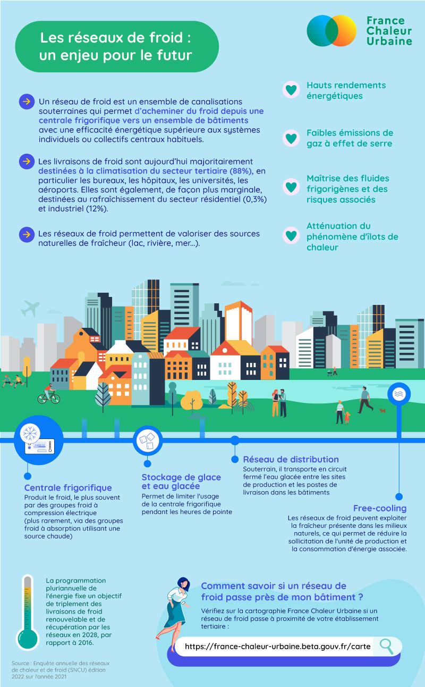

# Les réseaux de froid

❄️ Les réseaux de froid, vous connaissez ?\
Dans un contexte d’urbanisation croissante, de réchauffement climatique et de vieillissement de la population, le rafraichissement des bâtiments devient un enjeu majeur.\
\
☀️A l'approche de l'été, c'est le moment de mettre en avant les [#réseauxdefroid](https://www.linkedin.com/feed/hashtag/?keywords=r%C3%A9seauxdefroid\&highlightedUpdateUrns=urn%3Ali%3Aactivity%3A7071392707646042113), un système de refroidissement nettement plus performant que les [#climatisations](https://www.linkedin.com/feed/hashtag/?keywords=climatisations\&highlightedUpdateUrns=urn%3Ali%3Aactivity%3A7071392707646042113) individuelles et à faible impact environnemental.\
\
En France, on compte aujourd'hui 35 réseaux de froid. Un nombre appelé à largement augmenter dans les années à venir, pour couvrir des besoins en froid croissants et répondre aux objectifs réglementaires.\
\
👉 Pour comprendre les réseaux de froid en un coup d'œil, c'est ci-dessous !\
Et pour localiser les réseaux de froid, France Chaleur Urbaine propose désormais leur affichage sur sa carte.

<figure><figcaption></figcaption></figure>
