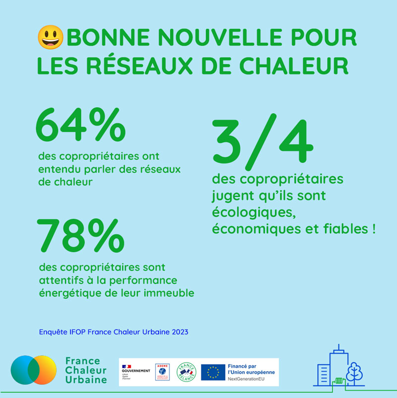

# Bonnes nouvelles pour les réseaux de chaleur

💡L'enquête [GROUPE IFOP](https://www.linkedin.com/company/ifop/) récemment menée pour France Chaleur Urbaine nous éclaire sur l'opinion des [#copropriétaires](https://www.linkedin.com/feed/hashtag/?keywords=copropri%C3%A9taires\&highlightedUpdateUrns=urn%3Ali%3Aactivity%3A7081951048663232513) à propos des réseaux de chaleur. Ces informations sont précieuses pour orienter notre stratégie mais aussi pour comprendre les marges de progression à un niveau plus large. Il nous semble donc important de communiquer sur les chiffres les plus manquants.\
😃 Aujourd'hui, on commence par les bonnes nouvelles !

