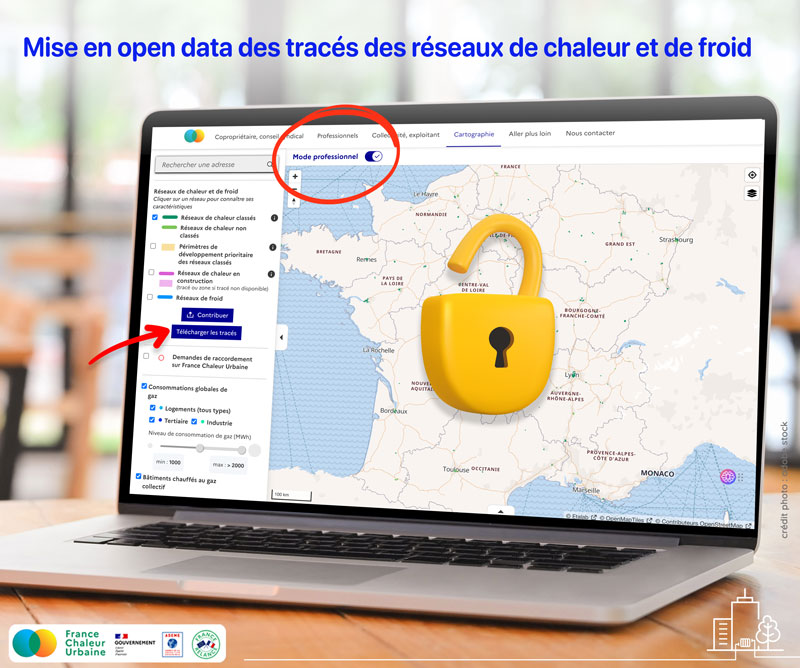

# Mise en open data des tracés des réseaux de chaleur et de froid

## France Chaleur Urbaine ouvre les données cartographiques des réseaux de chaleur au service de la transition énergétique

_Pour accélérer le développement des réseaux de chaleur, l’ouverture des tracés de ces réseaux était plébiscitée depuis plusieurs années par de nombreux acteurs : bailleurs sociaux, bureaux d’études, acteurs de la rénovation énergétique… Depuis le 1er septembre 2023, c’est désormais chose faite : après plus de deux années d’échanges avec la filière, la start-up d’Etat France Chaleur Urbaine a rendu librement téléchargeables pour la première fois les données cartographiques des réseaux de chaleur. Cette mise en ligne a été précédée d’un travail conséquent de recensement des tracés, qui permet aujourd’hui à la start-up de diffuser les données cartographiques de 639 réseaux. Ces avancées majeures devraient largement contribuer au développement des réseaux de chaleur._

### **Les réseaux de chaleur, un puissant levier de la décarbonation des bâtiments**

Pour rappel, un réseau de chaleur est un système de canalisations souterraines qui distribuent à un ensemble de bâtiments de la chaleur produite de façon centralisée. Alimentés majoritairement par des énergies renouvelables et de récupération locales (géothermie, combustion de la biomasse, récupération de la chaleur issue de l’incinération des déchets…), les réseaux de chaleur constituent **un mode de chauffage écologique émettant en moyenne deux fois moins de gaz à effet de serre qu’un chauffage au gaz ou fioul**. Le recours à des énergies locales permet également d’assurer des **tarifs compétitifs et plus stables** que ceux des énergies fossiles.

Pourtant, cette solution de chauffage écologique et économique ne couvre aujourd’hui que **5 % des besoins en chaleur nationaux.** Comme souligné par la Cour des comptes dans son rapport de septembre 2021, “l**e réseau de chaleur est une contribution efficace à la transition énergétique qui reste insuffisamment exploité**”. Le potentiel de raccordement des bâtiments aux réseaux de chaleur est en effet colossal. La Loi de transition énergétique pour la croissance verte prévoit une multiplication par 5 de la quantité de chaleur renouvelable livrée par les réseaux en 2030, par rapport à 2012, objectif aujourd’hui loin d’être atteint. Plus récemment, les documents de travail publiés par le Secrétariat général à la planification écologique (mai 2023) tablent sur plus d’un **doublement des livraisons de chaleur par les réseaux entre 2021 et 2030**. Cela passera par la création de nouveaux réseaux, par l’extension des réseaux existants, mais également par leur densification : de nombreux bâtiments situés à proximité immédiate des réseaux de chaleur sont encore aujourd’hui chauffés au gaz ou fioul, alors qu’ils pourraient y être raccordés.

### **Apporter de la lisibilité au secteur du chauffage urbain pour favoriser leur densification**

Le manque de lisibilité de la filière est sans aucun doute l’une des raisons du développement insuffisant des réseaux de chaleur au regard du potentiel et des objectifs réglementaires.

Est-ce qu’un réseau de chaleur passe à proximité de mon immeuble ? Est-ce que ce réseau est bien alimenté en énergies renouvelables ? Qui gère ce réseau de chaleur ? Qui contacter pour se raccorder ? Combien me coûtera la chaleur livrée par le réseau ? Répondre à ces questions était il y a peu de temps encore extrêmement difficile voire impossible, que ce soit pour le grand public ou pour les professionnels.

Afin de faciliter et multiplier les raccordements aux réseaux de chaleur, France Chaleur Urbaine s’est donc lancé mi-2021 dans un grand chantier de collecte de données, l’objectif étant de rendre accessibles à tous, de façon centralisée, l’ensemble de ces informations. Plusieurs données ont été collectées :

* les tracés des réseaux de chaleur existants, ainsi que les tracés de réseaux en construction ;
* les périmètres de développement prioritaire des réseaux dans lesquels s’appliquent des obligations de raccordement pour certains bâtiments, pour les réseaux dits “classés” ;
* l’identification des gestionnaires des réseaux (les réseaux de chaleur sont généralement créés par des collectivités, mais gérés par des opérateurs privés dans le cadre de délégations de service public) ;
* des données techniques : taux d’énergies renouvelables, contenu CO2, mix énergétique,…
* des informations tarifaires (prix moyen de la chaleur).

Ces éléments alimentent les différentes pages et outils proposés par la start-up, et notamment :

* la fonctionnalité phare du site, qui permet de renseigner son adresse (ou une liste d’adresses) pour vérifier si un réseau de chaleur passe à proximité et d’être mis en relation avec le gestionnaire du réseau pour envisager un raccordement. Disposer d’une bonne couverture des tracés des réseaux a permis d’améliorer significativement la qualité de la réponse apportée à ces tests ;
* la [cartographie interactive](https://france-chaleur-urbaine.beta.gouv.fr/carte) France Chaleur Urbaine, vers laquelle les collectivités sont invitées à renvoyer leurs administrés pour faire connaître leurs réseaux, et grâce à laquelle elles peuvent aussi étudier les potentiels de développement de leurs réseaux ;
* des fiches par réseau qui rassemblent pour chaque réseau l’ensemble des informations techniques et financières.

Aujourd’hui, près de 640 tracés sont recensés par France Chaleur Urbaine et visibles sur sa cartographie, un nombre en constante augmentation.

### **Comment ces données ont-elles été collectées ?**

La première étape de ce chantier a été la collecte des tracés des réseaux, indispensables pour pouvoir vérifier la proximité à un réseau de chaleur d’une adresse. La DRIEAT, qui porte France Chaleur Urbaine, disposait déjà d’une cartographie en open data en Ile-de-France, ce qui a permis de tester la pertinence du service avec la mise en ligne d’une première cartographie. Pour étendre le service à l’échelle nationale, l’enjeu de disposer des tracés des réseaux partout en France s’est rapidement imposé. Une cartographie nationale était alors proposée par l’association ViaSeva, mais avec une couverture perfectible et sans possibilité de téléchargement. Les premiers échanges avec la filière n’ont pas permis d’aboutir à la mise en open data des tracés diffusés par ViaSeva, en raison de craintes sur le statut juridique de ces données. Nous avons donc cherché à identifier et activer tous les moyens de récolter les tracés :

* via les **collectivités,** propriétaires des réseaux de chaleur publics. Nous avons ainsi contacté les unes après les autres plus d’une centaine de collectivités, et la collecte auprès de ces acteurs se poursuit aujourd’hui pour enrichir encore notre cartographie. Il s’agit d’un travail chronophage mais indispensable pour récolter les tracés des réseaux gérés en régie ou par des opérateurs locaux ;
* via les **principaux exploitants des réseaux de chaleur** : la montée en puissance du service France Chaleur Urbaine et la clarification du cadre juridique de diffusion des données nous ont progressivement permis d’obtenir les tracés des réseaux des quatre plus gros exploitants de réseaux de chaleur en France, ce qui a constitué une contribution significative ;
* via nos **partenaires institutionnels** : DREAL, ADEME, Cerema,…, qui nous ont permis d’enrichir notre base de données dans certaines régions.

Au delà des tracés, il nous est apparu important de pouvoir fournir des informations sur les caractéristiques techniques des réseaux, au vu de la grande hétérogénéité de fonctionnement des réseaux et des demandes formulées par nos utilisateurs. En particulier, le taux d’énergies renouvelables qui alimente les réseaux est fortement variable. Pour renseigner sur ces aspects, nous avons dans un premier temps diffusé les données réglementaires, à savoir les données de l’arrêté dit “DPE” qui fournit annuellement le taux d’énergies renouvelables et le contenu CO2 de chaque réseau, et la liste des réseaux classés (arrêté du 23 décembre 2022).

Ces données ont pu être largement enrichies par celles communiquées par ViaSeva et ENGIE en juin-juillet 2023, après plusieurs mois d’échanges. Grâce aux accords finalement trouvés avec la filière, les données de l’enquête annuelle des réseaux de chaleur et de froid réalisée par le SNCU (Syndicat national du chauffage urbain et de la climatisation urbaine) sont ainsi désormais diffusées sur France Chaleur Urbaine.

Quant à la diffusion d’indicateurs de prix, elle a été possible grâce à l’arrêté relatif au classement publié le 30 novembre 2022, qui instaure une remontée centralisée de ces indicateurs au SNCU pour tous les réseaux classés. Cette centralisation, demandée par France Chaleur Urbaine lors de l’élaboration de l’arrêté, permet aujourd’hui de fournir un prix moyen de la chaleur pour les réseaux classés (environ 2/3 des réseaux français). L’information tarifaire pour les réseaux non classés est l’un des chantiers sur lesquels la start-up souhaite pouvoir avancer dans les prochains mois.

### **Pourquoi mettre ces données en open data?**

Dès son lancement, la start-up France Chaleur Urbaine a fait part de son souhait de diffuser en open data les tracés et données de réseaux de chaleur, afin de permettre leur libre réutilisation par tout acteur en ayant le besoin, mais aussi pour se conformer aux obligations réglementaires prévues par le code des relations entre le public et l’administration.

**Une mise en open data plébiscitée par de nombreux acteurs**

Observatoires régionaux, bureaux d’études, bailleurs sociaux, acteurs de la rénovation, institutionnels : nombreux sont les acteurs à attendre depuis plusieurs années l’ouverture des données des réseaux de chaleur, afin de pouvoir les intégrer dans leurs propres outils. Cette intégration ne peut que contribuer au développement des réseaux. Elle rendra notamment possible la diffusion des tracés sur différents sites, permettant aux réseaux de chaleur de gagner fortement en visibilité. Ainsi, plusieurs gestionnaires de plateformes et observatoires régionaux et nationaux ont déjà fait part à France Chaleur Urbaine de leur souhait d’intégrer les réseaux de chaleur sur leurs sites (GoRénove, Prioréno, Terristory, Observatoire climat air énergie Grand-Est, …). La mise en open data des tracés permettra également leur intégration dans des outils internes utilisés notamment à des fins de planification. A titre d’exemple, certains bailleurs sociaux ont contacté France Chaleur Urbaine dans cet objectif : pouvoir intégrer les tracés et données des réseaux de chaleur dans leurs outils facilitera l’élaboration de stratégie de décarbonation à l’échelle de leur parc.

**Une obligation réglementaire**

Le souhait de mise en open data des tracés et données des réseaux de chaleur par France Chaleur Urbaine a initialement soulevé certaines réticences de la filière, par crainte que ces données soient protégées par le secret industriel et commercial. Une note de l’Administratrice générale des données, des algorithmes et des codes sources, sollicitée par France Chaleur Urbaine sur le sujet début 2023, a permis de clarifier le cadre juridique, et a confirmé que l’ensemble de ces données ont au contraire vocation à être diffusées et librement réutilisables. Si l’on prend le cas des tracés, plusieurs régimes juridiques s’appliquent :

* la majorité des réseaux de chaleur sont des réseaux de service public. Réalisés dans le cadre d’une mission de service public, les tracés ont donc le statut de document administratif, ce qui entraine l’application des règles prévues par le Code des relations entre le public et l'administration en matière de communication, diffusion et réutilisation de documents administratifs (obligation de diffusion des documents administratifs, notamment pour tout document présentant un intérêt environnemental) ;
* les réseaux sont le plus souvent souvent gérés dans le cadre de concessions de service public : le code de la commande publique prévoit alors que le concessionnaire doit fournir à l’autorité concédante sous format électronique, dans un standard ouvert librement réutilisable et exploitable, les données collectées ou produites dans le cadre du service public faisant l’objet du contrat ;
* la chaleur est considérée comme un rejet dans l’environnement : les tracés des réseaux relèvent donc d’informations relatives à l’émission de substances dans l’environnement, pour laquelle le code de l’environnement a organisé un régime favorable d’accès, avec de rares cas possibles de refus de communication, dans lesquels les tracés des réseaux ne peuvent rentrer.

La note de l’Administratrice générale des données, des algorithmes et des codes sources a de même conclu à la communicabilité des données relatives aux taux d’énergies renouvelables des réseaux, ainsi qu’à celle des données de tarification globale et individuelle, nécessaires à la bonne information du consommateur.

Cette clarification du cadre juridique s’appliquant aux données des réseaux de chaleur a constitué un élément clé permettant d’aboutir à leur mise en open data.

### Encore des **perspectives d’amélioration**

Dans les prochains mois, nous souhaitons améliorer encore la qualité des données diffusées et mises en open data par France Chaleur Urbaine, et notamment :

* aboutir à une couverture quasi exhaustive en termes de tracés : sur les 898 réseaux recensés par le SNCU, 259 tracés restent à collecter par France Chaleur Urbaine. A noter toutefois que certains réseaux sont des réseaux de très petite taille, alimentant parfois uniquement les bâtiments de la collectivité. Il est alors difficile de les récupérer, les collectivités ne disposant elles-mêmes pas toujours d’un plan à jour et en format SIG ;
* intégrer dans le jeu de données téléchargeables les périmètres de développement prioritaire et réseaux en construction, après avoir là aussi amélioré leur couverture ;
* compléter les indicateurs de prix, en particulier pour les réseaux non classés, fournir des éléments d’interprétation de ces données tarifaires (via la mise en place d’un comparateur avec le prix des autres énergies), et rendre ces données librement réutilisables.

### De la p**ersévérance et un cadre juridique bien défini : les clés pour l’ouverture des données !**

De notre retour d’expérience, nous retiendrons que l’ouverture des données des réseaux de chaleur n’aura pas été aisée mais aura finalement pu aboutir après plus de deux ans d’échange avec la filière, grâce à deux éléments clés :

* beaucoup de persévérance, pour convaincre de la nécessité de mise en open data des données, et de son intérêt ;
* un cadre juridique défini par un document officiel, qui aura été indispensable pour rassurer les acteurs, publics comme privés, de l’absence de tout risque associé à la mise en open data des données.

_Le fichier de tracés est téléchargeable depuis notre_ [_cartographie_](https://france-chaleur-urbaine.beta.gouv.fr/carte) _(Mode professionnel) ou_ [_ici_](https://france-chaleur-urbaine.beta.gouv.fr/professionnels#cartographie)_. Il est également en ligne sur_ [_data.gouv.fr_](https://www.data.gouv.fr/fr/datasets/traces-des-reseaux-de-chaleur-et-de-froid/)_._

