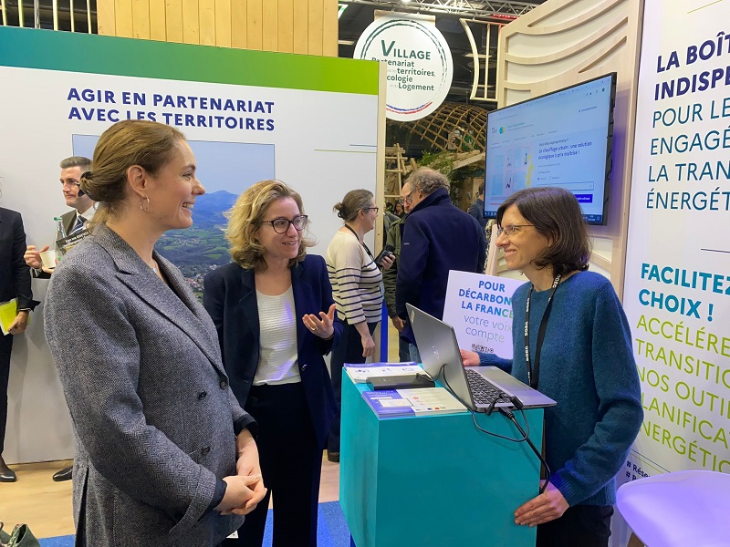
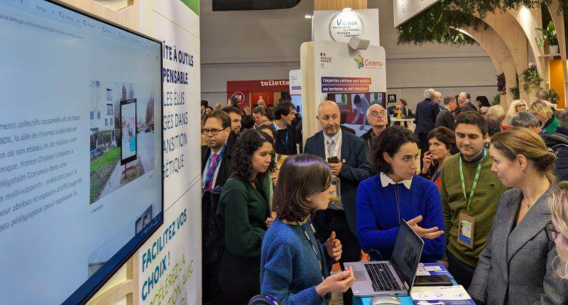

# Présentation de France Chaleur Urbaine à la ministre déléguée chargée de l'Énergie

Nous sommes très heureux d'avoir pu **présenter France Chaleur Urbaine à la ministre déléguée chargée de l'Énergie Olga Givernet**, au [Salon des Maires et des collectivités](https://www.salondesmaires.com/le-salon-des-maires-et-des-collectivites/). Un grand merci pour votre écoute attentive Madame la Ministre ! 🙏 Merci également à la Direction générale de l’énergie et du climat de nous avoir donné cette opportunité.

\
🎯 France Chaleur Urbaine contribue à l'atteinte des objectifs de développement des réseaux de chaleur en France en offrant des outils et services simples et concrets qui **facilitent le passage à l'action**. Il répond aux besoins de l'ensemble des parties prenantes et notamment :\
✔ des **copropriétaires, bailleurs sociaux, gestionnaires de bâtiments tertiaires**, en les aidant à raccorder leurs bâtiments ;\
✔ des **collectivités et opérateurs**, en les accompagnant dans le développement de leurs réseaux.

<figure><figcaption></figcaption></figure>

 

<figure><figcaption></figcaption></figure>

