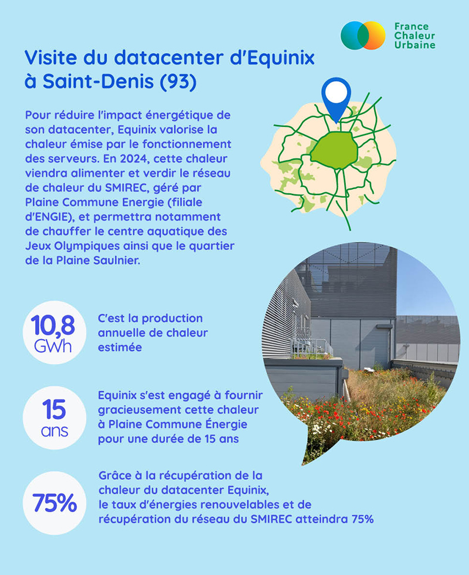

# Visite d'un data center

Après notre infographie sur la chaleur fatale, direction Saint-Denis (93) pour une illustration en image, avec la visite du datacenter [Equinix](https://www.linkedin.com/company/equinix/).\
\
L'accroissement continu des usages du numérique entraîne une multiplication des datacenters, fortement consommateurs d'énergie et dont l'empreinte carbone n'est pas négligeable. Pour réduire leur impact environnemental, l'une des solutions consiste à récupérer la chaleur produite par les serveurs, afin d'alimenter les réseaux de chaleur.\
\
👉 C'est ce que met en œuvre [Equinix](https://www.linkedin.com/company/equinix/) à Saint-Denis !\
\
En 2024, la chaleur de son datacenter alimentera le réseau de chaleur du [SMIREC Syndicat mixte des réseaux d'énergie calorifique](https://www.linkedin.com/in/ACoAADMxsCQB3VlRzuR-CxiTOxUtx6kW-PvURks), exploité par Plaine Commune Energie ([ENGIE](https://www.linkedin.com/company/engie/)), et permettra notamment de chauffer le centre aquatique des Jeux Olympiques. 🏊‍♂️

<figure><figcaption></figcaption></figure>

 

<figure><figcaption></figcaption></figure>

 

<figure><figcaption></figcaption></figure>

 

<figure><figcaption></figcaption></figure>

