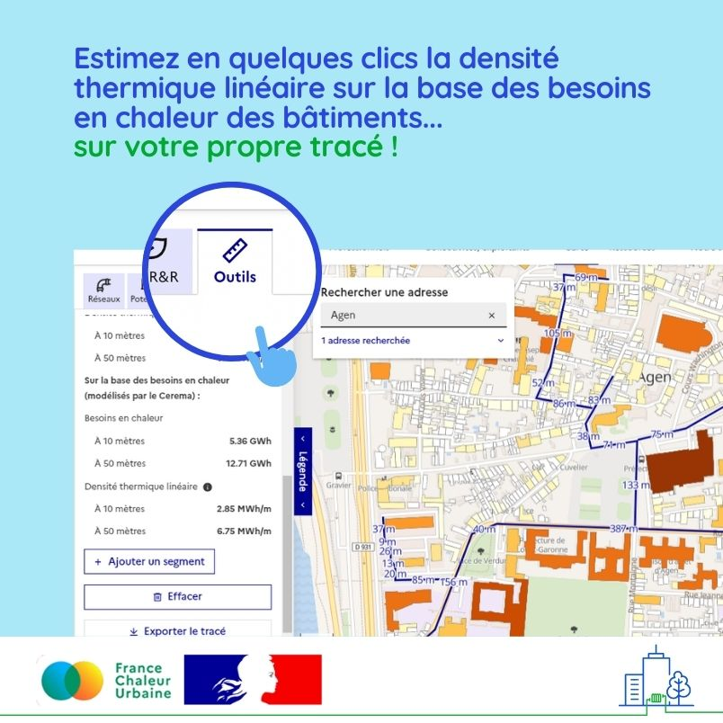

# Estimer en quelques clics la densité thermique linéaire d'un futur réseau

Avec France Chaleur Urbaine, estimer en quelques clics la densité thermique linéaire d'un futur réseau, c'est possible !\
\
💡 Pour évaluer la pertinence de créer un nouveau réseau de chaleur ou d'étendre un réseau existant, la densité thermique linéaire est un paramètre clé à étudier. Elle correspond au rapport entre la quantité de chaleur livrée et la longueur de canalisations à déployer. Un seuil critique de 1,5 MWh par mètre linéaire est généralement retenu, notamment pour bénéficier des aides du [Fonds Chaleur ADEME](https://fondschaleur.ademe.fr/).\
\
🔧 Déjà proposé sur la base des consommations réelles de gaz, le calcul de la densité thermique linéaire sur France Chaleur Urbaine est aujourd'hui également réalisé sur la base des besoins en chaleur des bâtiments, modélisés par le Cerema dans le cadre du [projet EnRezo](https://reseaux-chaleur.cerema.fr/espace-documentaire/enrezo) : une donnée estimative mais qui présente l'avantage d'être disponible pour l'ensemble des bâtiments.\
\
👉 Concrètement comment faire ? Je clique sur l'onglet [Outils](https://france-chaleur-urbaine.beta.gouv.fr/carte?tabId=outils) dans la légende de la carte et je définis mon futur tracé. Le résultat s'affiche instantanément ! Je peux également exporter mon projet de tracé.

<figure><figcaption></figcaption></figure>
