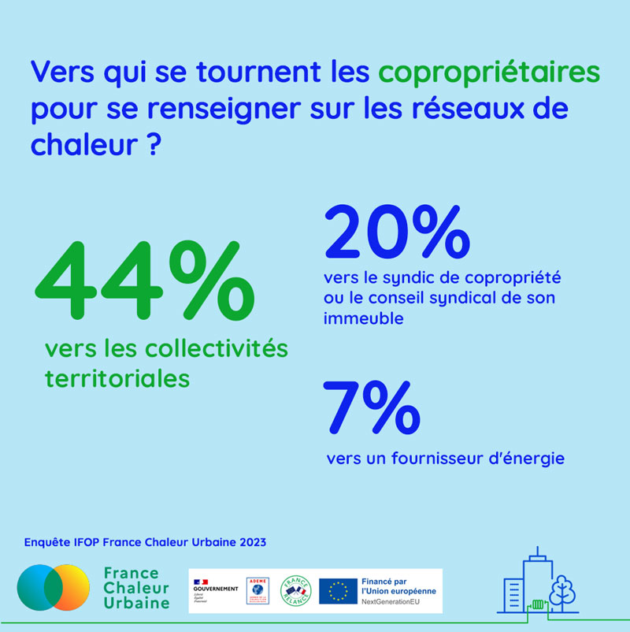

# Les chiffres de l'enquête IFOP 3

Toujours grâce à l'enquête [GROUPE IFOP](https://www.linkedin.com/company/ifop/) pour France Chaleur Urbaine sur les [#copropriétaires](https://www.linkedin.com/feed/hashtag/?keywords=copropri%C3%A9taires\&highlightedUpdateUrns=urn%3Ali%3Aactivity%3A7087085077070786560) et les [#réseauxdechaleur](https://www.linkedin.com/feed/hashtag/?keywords=r%C3%A9seauxdechaleur\&highlightedUpdateUrns=urn%3Ali%3Aactivity%3A7087085077070786560), on découvre que ce sont bien les collectivités qui sont identifiées comme la porte d'entrée pour obtenir des informations.\
France Chaleur Urbaine s'est justement fixé pour mission de les aider à faire connaître leur réseaux de chaleur, en mettant à leur disposition :\
👉 une [#cartographie](https://www.linkedin.com/feed/hashtag/?keywords=cartographie\&highlightedUpdateUrns=urn%3Ali%3Aactivity%3A7087085077070786560) interactive pour faire connaître les tracés de leurs réseaux, projets d’extension, périmètres de développement prioritaire... désormais intégrable sur tout site internet\
👉 des éléments pour communiquer auprès du grand public : kit de communication, campagne de pub...\
France Chaleur Urbaine c'est aussi un espace gestionnaire partagé accessible aux [#collectivités](https://www.linkedin.com/feed/hashtag/?keywords=collectivit%C3%A9s\&highlightedUpdateUrns=urn%3Ali%3Aactivity%3A7087085077070786560) et [#exploitants](https://www.linkedin.com/feed/hashtag/?keywords=exploitants\&highlightedUpdateUrns=urn%3Ali%3Aactivity%3A7087085077070786560), pour retrouver l'ensemble des demandes reçues sur leurs réseaux.\
🤝 Collectivités, n'hésitez pas à nous contacter pour découvrir tout ce que France Chaleur Urbaine peut faire pour vous !

