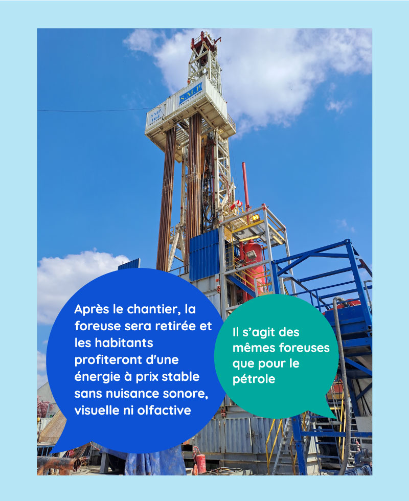

# Visite d'un forage de géothermie

Pour illustrer en images la [#géothermie](https://www.linkedin.com/feed/hashtag/?keywords=g%C3%A9othermie\&highlightedUpdateUrns=urn%3Ali%3Aactivity%3A7055143326697549824) profonde, dont nous vous parlions dans notre dernier post, direction [Ville de Champigny-sur-Marne](https://www.linkedin.com/company/villedechampignysurmarne/) (94) !\
Ce mardi, l'équipe France Chaleur Urbaine était sur le forage débuté mi-février, qui permettra d'ici mi-mai d'atteindre la nappe du Dogger dont la température avoisine les 70°C. Un [#réseaudechaleur](https://www.linkedin.com/feed/hashtag/?keywords=r%C3%A9seaudechaleur\&highlightedUpdateUrns=urn%3Ali%3Aactivity%3A7055143326697549824) de 9 km permettra ensuite d'acheminer la chaleur géothermique vers 52 postes de livraison.\
Un grand merci à [Groupe Coriance](https://www.linkedin.com/company/groupe-coriance/) et [Audrey CONSTANTIN](https://www.linkedin.com/in/ACoAABcGCLUBPGObMQkIy3K8ZDyqcWyvfPouqvE) pour l'organisation de cette visite.

.jpg>)
