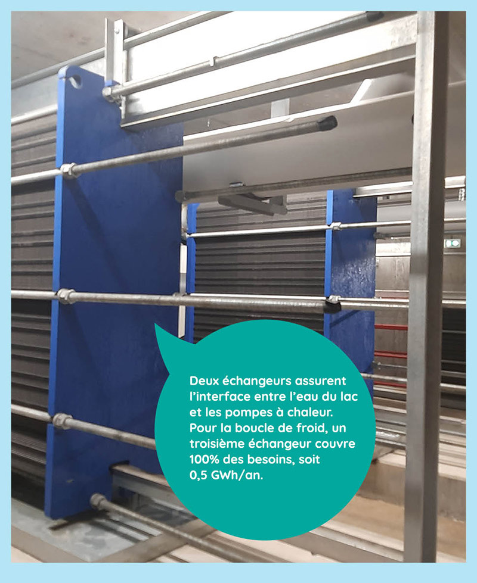

# Visite du réseau de froid d'Annecy

Après notre infographie sur les réseaux de froid, direction annecy (74) pour un exemple en images, avec la visite du premier réseau de chaleur et de froid alimenté par un lac en France.\
Baptisé « Ali énergie », ce réseau innovant a été mis en service en avril 2023 par la société IDEX. En été l'eau du lac, plus fraîche que la température ambiante, permet d'assurer le rafraîchissement des bâtiments tout en évitant les nuisances des climatiseurs individuels.

<figure><figcaption></figcaption></figure>

 

<figure><figcaption></figcaption></figure>

 

<figure><figcaption></figcaption></figure>

 

<figure><figcaption></figcaption></figure>

