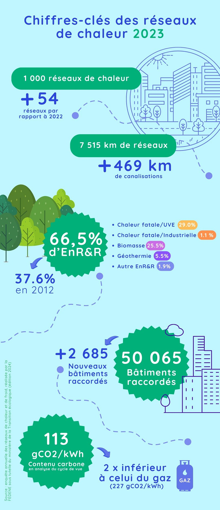

# Chiffres-clés 2023 des réseaux de chaleur

🔎 Développement des réseaux de chaleur en France : où en est-on ? Réponse sur la base de l'enquête réalisée chaque année par la FEDENE sous tutelle du ministère de la Transition écologique !\
\
La [dernière enquête](https://fedene.fr/enquete-annuelle-des-reseaux-de-chaleur-froid-2024/), portant sur l'année 2023, montre que la barre symbolique des 1000 réseaux recensés a été franchie. En 2023, on compte 5% de bâtiments supplémentaires raccordés aux réseaux de chaleur, avec un total de plus de 50 000 bâtiments raccordés.\
\
🚀 Et la dynamique est amenée à se poursuivre ! Des études de raccordement sont actuellement en cours pour plus de 1200 bâtiments, suite à des demandes déposées sur France Chaleur Urbaine. En outre, une soixantaine de communes ont déjà manifesté leur intérêt pour être accompagnées dans un projet de création de réseau de chaleur, suite à la mise en ligne de notre nouvel outil dédié aux communes sans réseau.\
\
🍃 Avec un contenu CO2 moyen réduit de moitié par rapport à un chauffage au gaz, et trois fois inférieur à celui du fioul, les réseaux de chaleur constituent un levier efficace pour accélérer la décarbonation du bâtiment.\
\
👉 Focus sur quelques chiffres-clés ci-dessous

<figure><figcaption></figcaption></figure>
