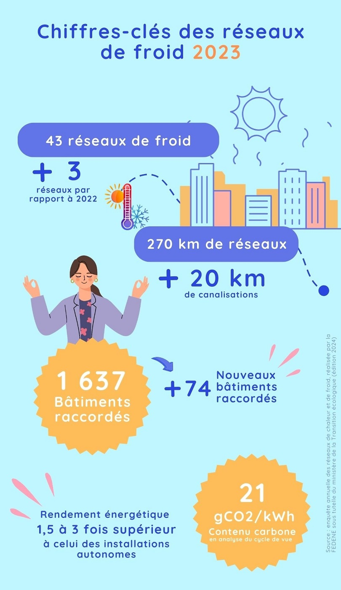

# Chiffres-clés 2023 des réseaux de froid

Après les chiffres-clés 2023 des réseaux de chaleur, nous vous présentons aujourd'hui ceux des réseaux de froid.\
\
🏙️ Dans un contexte de réchauffement climatique, les réseaux de froid constituent une solution d'avenir pour le refroidissement des bâtiments en ville !\
\
❄️ Un réseau de froid est constitué de canalisations souterraines qui acheminent le froid produit au niveau d’une centrale frigorifique vers un ensemble de bâtiments. Les réseaux de froid peuvent valoriser des sources naturelles de fraîcheur : lacs, rivières, mer... La production de froid par une installation industrielle permet d’atteindre des rendements énergétiques élevés. De plus, les réseaux de froid évitent l'amplification des effets d'îlots de chaleur urbains, contrairement aux systèmes de climatisation classiques.\
\
🔎 D'après l'[enquête annuelle](https://fedene.fr/enquete-annuelle-des-reseaux-de-chaleur-froid-2024/) réalisée par la FEDENE sous tutelle du ministère de la Transition écologique, en 2023 on compte 43 réseaux de froid en France, alimentant 1637 bâtiments. 94% des livraisons de froid climatisent des bâtiments tertiaires.

<figure><figcaption></figcaption></figure>
