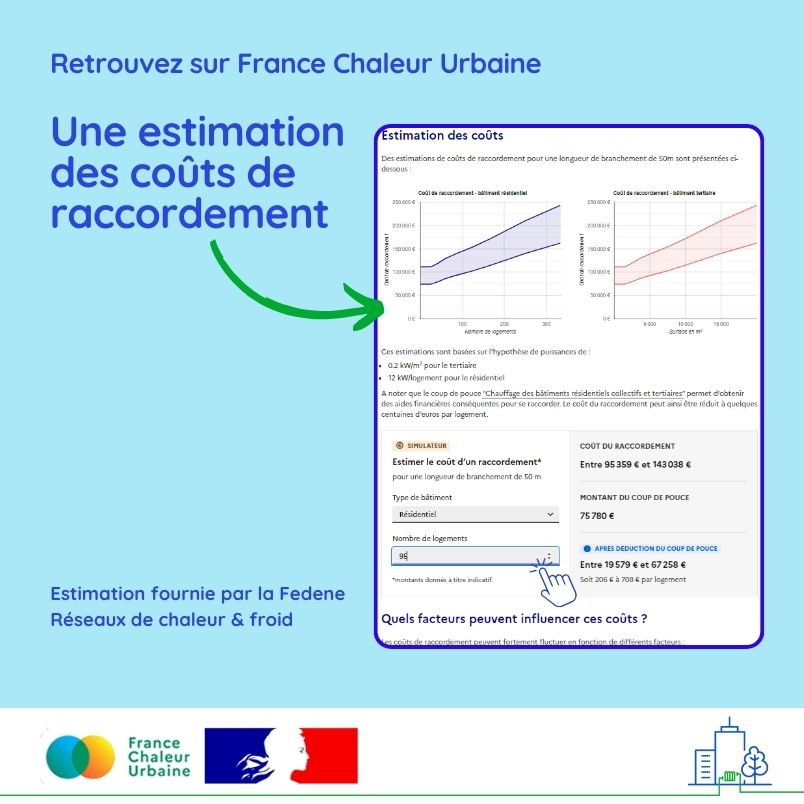

# Combien coûte un raccordement ?

💸 Combien coûte un raccordement à un réseau de chaleur ? Difficile de répondre à cette question, tant ce coût peut être influencé par de nombreux paramètres : longueur de branchement, taille de l'échangeur, configuration de la voirie... Et pourtant, c'est la première question que se pose toute personne souhaitant envisager un raccordement !\
\
🔎 Pour y apporter des éléments de réponse, nous sommes heureux de pouvoir diffuser de premières estimations, fournies par la [FEDENE Réseaux de chaleur & froid](https://fedene.fr/mission/reseaux-de-chaleur-et-de-froid/). Une fourchette de coûts pour une longueur de branchement de 50m est désormais disponible, en fonction du nombre de logements pour un bâtiment résidentiel et du nombre de mètres carrés pour un bâtiment tertiaire (donnée à titre indicatif : se rapprocher du gestionnaire pour obtenir un devis précis demeure indispensable !).\
\
📈 L'information est diffusée à la fois sous forme de graphiques et via un simulateur, qui permet en outre d'évaluer le coût restant après déduction du Coup de pouce chauffage des bâtiment résidentiels collectifs et tertiaires. Les facteurs susceptibles de faire varier les coûts sont par ailleurs recensés. (Lien en commentaire)\
\
👉 Une nouvelle étape est ainsi franchie vers davantage de transparence sur les tarifs, chantier que nous poursuivrons ces prochains mois.\
\
🙏 Un grand merci à la FEDENE Réseaux de chaleur & froid pour la transmission de ces éléments.

<figure><figcaption></figcaption></figure>
