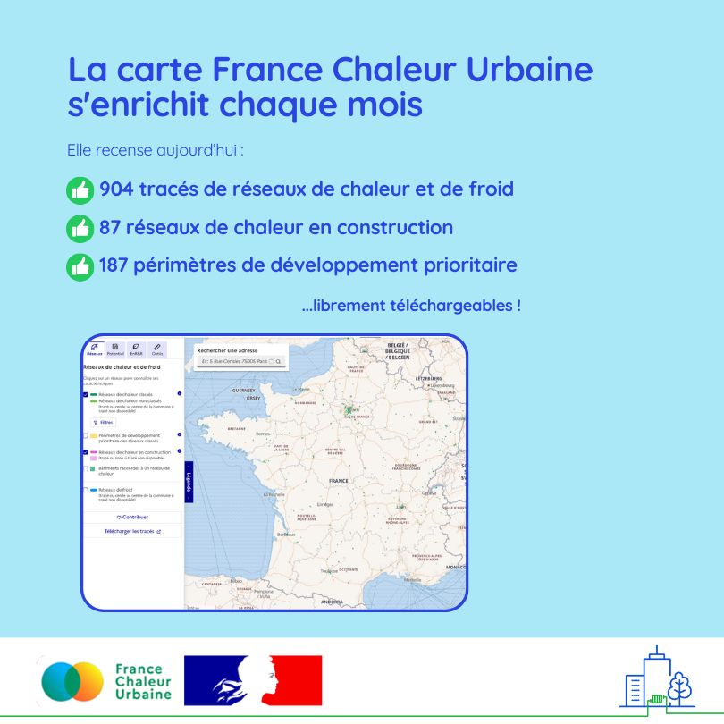

# De nombreux ajouts sur notre carte ce mois-ci !

🗺️ Grâce à l'important travail de collecte réalisé par France Chaleur Urbaine, sa [carte](/carte) s'enrichit chaque mois. Un travail au service du développement des réseaux de chaleur et de froid, utile aussi bien aux professionnels qu'à toute personne s'intéressant aux réseaux !\
\
💥 De nombreux tracés et périmètres de développement prioritaire viennent d'être ajoutés, grâce à une campagne de recensement adressée aux réseaux concernés par le classement automatique. Le nombre de réseaux en construction figurant sur la carte progresse également, grâce aux contributions reçues dans le cadre des demandes de subvention au titre du Fonds Chaleur.

Ainsi, on compte ce mois-ci :\
\+ 30 réseaux de chaleur et + 1 réseau de froid\
\+ 20 réseaux de chaleur en construction (nouveau réseau ou extension)\
\+ 30 périmètres de développement prioritaire.\
\
👉 L'ensemble des données est librement téléchargeable sur [data.gouv.fr](<README (1).md>).\
Quelques exemples d'ajouts :\
✔️ Les réseaux de chaleur en service à [Montemboeuf](/reseaux/1606C), [Arinthod](/reseaux/3905C), [Le Lindois](/reseaux/1613C), Nègrepelisse, [Le Russey](/reseaux/2504C)... \
✔️ Les réseaux en construction à [Saint-Nazaire](https://www.saintnazaireagglo.fr/), [Vierzon](http://www.ville-vierzon.fr/), [Cannes-Mandelieu](https://cannespaysdelerins.fr/), [Villeneuve-la-Garenne](https://villeneuve92.com/), [Bitche](https://www.ville-bitche.fr/)...\
✔️ Les périmètres de développement prioritaire des réseaux de [Barcelonnette](/reseaux/0406C), [Epinal](/reseaux/8801C), [Colombes](/reseaux/9233C), [Graulhet](/reseaux/8105C), [Le Mans](/reseaux/7203C)...

<figure><figcaption></figcaption></figure>
