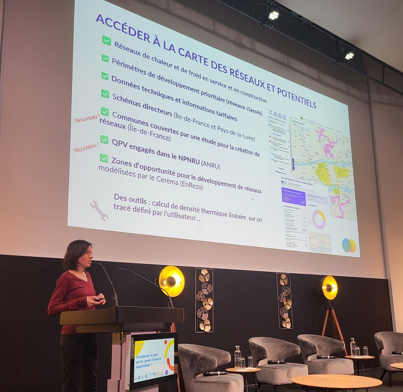

# Décarboner le parc social

🏙️Pour décarboner le parc social, quels vecteurs disponibles ? C'était la question au cœur de la journée professionnelle de [L'Union sociale pour l'habitat](https://www.union-habitat.org/) qui s'est tenue le 27 mars 2025, à laquelle nous avons eu le plaisir d'intervenir !\
\
Les réseaux de chaleur constituent l'un des leviers privilégiés pour cette décarbonation. France Chaleur Urbaine développe de nombreux outils pour aider les bailleurs sociaux à y raccorder leurs bâtiments, et notamment :\
✔️ la mise en relation avec les gestionnaires des réseaux, pour simplifier les démarches ;\
✔️ le [test en masse](/inscription), pour identifier instantanément les adresses potentiellement raccordables d'un parc de bâtiments ;\
✔️ la [carte de référence](/carte) des réseaux de chaleur et de froid, pour tout savoir sur les réseaux existants ou en projet, et leur potentiel de développement ;\
✔️ le [comparateur de coût et d'émissions de CO2](/comparateur-couts-performances) des modes de chauffage, réalisé en partenariat avec l'[Association AMORCE](https://amorce.asso.fr/), pour comparer les performances économiques et environnementales des différents modes de chauffage.\
\
Un grand merci à [L'Union sociale pour l'habitat](https://www.union-habitat.org/) de nous avoir donné l'occasion de faire connaître ces outils lors de sa journée professionnelle !

<figure><figcaption></figcaption></figure>
