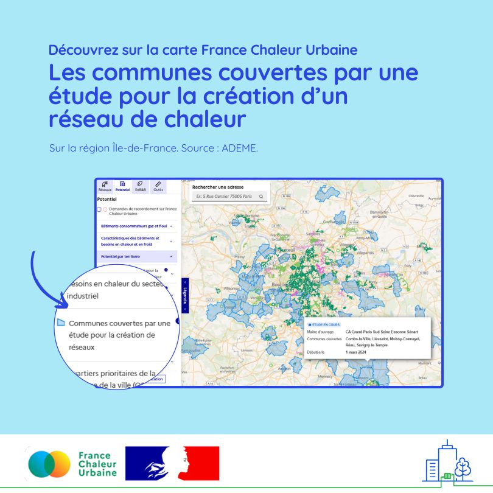

# Découvrez les communes couvertes par une étude pour la création de réseaux

🔎 Identifier en un coup d’œil les territoires sur lesquels une étude pour la création de réseaux de chaleur a été réalisée ou est en cours ? C'est désormais possible sur la [carte France Chaleur Urbaine](https://france-chaleur-urbaine.beta.gouv.fr/carte?coord=2.4734448,48.8059000\&zoom=8.46\&tabId=potentiel\&accordions=Potentiel+par+territoire\&additionalLayers=etudesEnCours) ! Les gestionnaires de bâtiments intéressés pour se raccorder à un futur réseau pourront ainsi manifester sans attendre leur intérêt pour ce mode de chauffage.\
\
🗺️ Cette information est aujourd'hui disponible sur toute l'Île-de-France, grâce aux informations transmises par la Direction régionale de l'[ADEME](https://www.ademe.fr/), avec pour objectif de l'étendre peu à peu à l'échelle nationale.

<figure><figcaption></figcaption></figure>
